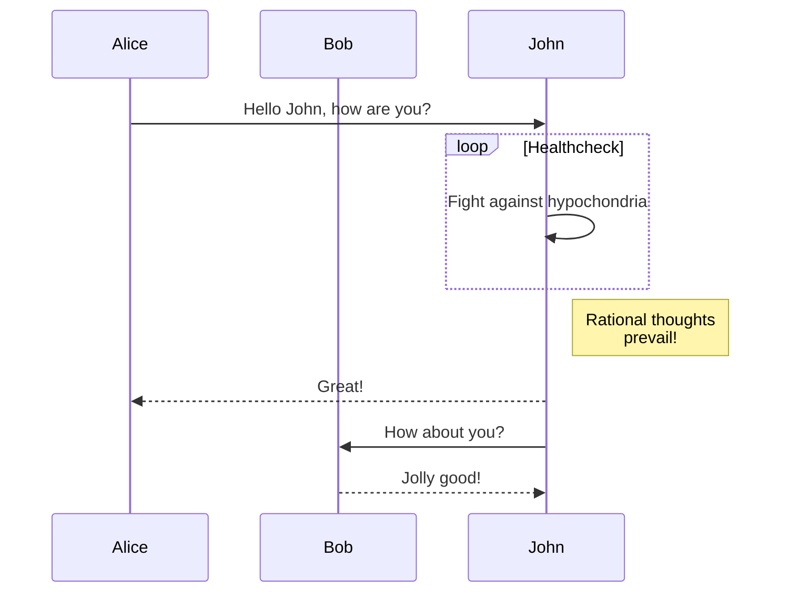
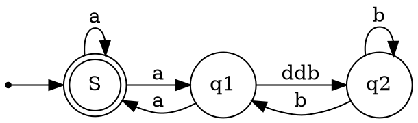

# Computer-Science

Computer Science repository for annotations on classes

The annotations are done in [markdown](https://markdownguide.org/), and globally styled with the `./static` files.

## Math

The math blocks are rendered through [Katex](http://katex.org/), using \$. Math blocks can be inline, like `$x^2 + 1 = 0$` $x^2 + 1 = 0$, or in a block, like:

```markdown
$$
X \sim \mathcal{N}(\mu,\,\sigma^{2})
$$
```

$$
X \sim \mathcal{N}(\mu,\,\sigma^{2})
$$

## Graphs

The graphs can be made in 2 ways: with [mermaid](https://mermaid.js.org/) and with [graphviz](https://graphviz.org/) (dot).

### [Mermaid](https://mermaid.js.org/)

Mermaid lets you create diagrams and visualizations using text and code. It is a JavaScript based diagramming and charting tool that renders Markdown-inspired text definitions to create and modify diagrams dynamically.

````md

````


### [Graphviz](https://graphviz.org/)

Graphviz is open source graph visualization software. Graph visualization is a way of representing structural information as diagrams of abstract graphs and networks. It has important applications in networking, bioinformatics, software engineering, database and web design, machine learning, and in visual interfaces for other technical domains.

````md

````


# Getting Started

1. Clone the repository with `git clone https://github.com/ArthurMartelli/Computer-Science`.
2. Begin typing in the files.
