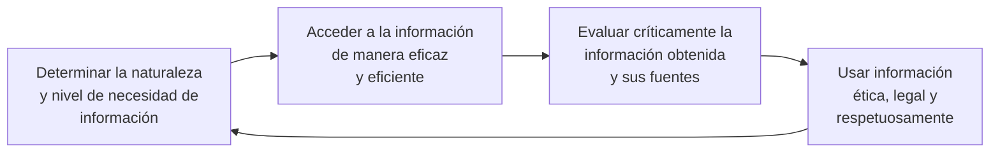
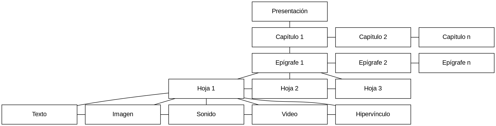

<!-- title: SON0 SOCIEDAD DE LA INFORMACION -->

<link rel="stylesheet" href="../../static/style.css">

<header>

# SON0 SOCIEDAD DE LA INFORMACION <!-- omit in toc -->

## Universidad Francisco Gavidia | Ingeniería en Ciencias de la Computación <!-- omit in toc -->

### Date <!-- omit in toc -->

</header>

<toc>

# Índice <!-- omit in toc -->

- [1. SON0 SOCIEDAD DE LA INFORMACION](#1-son0-sociedad-de-la-informacion)
- [2. Gestión de la Información](#2-gestión-de-la-información)
  - [2.1. Alfabetización de la Información](#21-alfabetización-de-la-información)
  - [2.2. Acceso a la información](#22-acceso-a-la-información)
  - [2.3. Recursos de información y su aprovechamiento en el proceso de enseñanza aprendizaje](#23-recursos-de-información-y-su-aprovechamiento-en-el-proceso-de-enseñanza-aprendizaje)
  - [2.4. Evaluación](#24-evaluación)
- [3. Ciencias humanas, de la comunicación y educación](#3-ciencias-humanas-de-la-comunicación-y-educación)
  - [3.1. Comunicación y evaluación de la información](#31-comunicación-y-evaluación-de-la-información)
  - [3.2. Introducción a la sociedad del conocimiento](#32-introducción-a-la-sociedad-del-conocimiento)
  - [3.3. Evaluación](#33-evaluación)
- [4. Persona Humana y Sociedad](#4-persona-humana-y-sociedad)
- [5. Enfoque de Derechos e Inclusión](#5-enfoque-de-derechos-e-inclusión)

</toc>

# 1. SON0 SOCIEDAD DE LA INFORMACION

# Introducción <!-- omit in toc -->

Sean bienvenidos a estudiar la asignatura Sociedad de la Información, nos introduciremos a una nueva sociedad, dinámica, intercomunicada, global, fascinante, donde todo cambia rápidamente al ritmo vertiginoso de los avances científicos y tecnológicos, en la cual tenemos que vivir de acuerdo a las exigencias de esta sociedad, estar informados, actualizados, innovar, donde se generan propuestas y saberes que surgen de los datos que circulan en la red.

En esta asignatura encontraras los elementos fundamentales sobre el aparecimiento y evolución de las nuevas tecnologías de la información y comunicación, se tomará en cuenta la concepción de la sociedad del conocimiento, las problemáticas sociales actuales de las personas, como la violencia, inmigración, subdesarrollo, así como el enfoque de derechos e inclusión.

Con el conocimiento adquirido tendrás elementos para proponer alternativas en beneficio de una sociedad que exige cambios constantes para sobrevivir a las necesidades del siglo XXI.

## Objetivos <!-- omit in toc -->

Identificar y acceder a las nuevas tecnologías de la información y comunicación, reconociendo e interpretando también los cambios sociales que se generan por la cultura y globalización a nivel mundial.

# 2. Gestión de la Información

## Objetivos <!-- omit in toc -->

- Utilizar los diferentes tipos de fuentes de acceso a la información, confiable, oportuna y eficaz , haciendo diferencia de los recursos tecnológicos.

## 2.1. Alfabetización de la Información

El presente tema es impartido con el propósito de introducirlos a la adecuada búsqueda de la información y poseer la capacidad de localizar, evaluar y utilizar eficazmente la información requerida.

### Objetivos

- Estudiar algunas diferencias entre los términos costo y gasto, que servirán para tener más claro el objetivo que juega cada uno de ellos.
- Conocer como se define el concepto de la contabilidad de costos y su objetivo que es de suministrar información, para que la dirección determine precios adecuados y proyectar una mejor gestión sobre la actividad que origina llevar contabilidad.

### Contenido

#### Sociedad de la Información

Antes de introducirnos en el tema principal, conoceremos sobre la Sociedad de la Información.

En los años 90 la expresión "Sociedad de la Información", centralizó la descripción de las profundas transformaciones sociales derivadas de la acelerada introducción en la sociedad de la inteligencia artificial y de la tecnología de la información y comunicaciones, TIC.

Los antecedentes del término, datan de décadas anteriores. En 1973, el sociólogo estadounidense Daniel Bell (191), introdujo la noción de la "Sociedad de la Información" cuando argumentó que la sociedad post-industrial reemplazaría la sociedad industrial y sería el nuevo sistema dominante regido por la información y orientado a los servicios.

Bell señaló tres componentes que definirían una sociedad post industrial:

- El reemplazo de las manufacturas por los servicios
- La centralización de las nuevas industrias basadas en las ciencias
- El ascenso de una nueva élite tecnológica que definiría la estructura de la sociedad; predicciones que se cumplen actualmente.

Años después reaparece la expresión "Sociedad de la Información" en las distintas etapas de desarrollo de Internet y las TIC.

##### Yoneji Masuda

Yoneji Masuda (1905-1995) sociólogo japonés, define estratégicamente un modelo de sociedad tecnológica para el Japón, su libro La Sociedad de la Información como una sociedad post-industrial contribuyó a la difusión del termino y sentó las bases de muchos planes de desarrollo actualmente vigente.

##### Abdul Waheed Khan

Según Abdul Waheed Khan, subdirector general de la UNESCO, para la Comunicación y la Información afirma que "la Sociedad de la Información", es la piedra angular de las sociedades del conocimiento ya que el término (Sociedad de la Información) está relacionado con la idea de la "Innovación tecnológica".(Andrada, Ana María (2010) Nuevas tecnologías de la información y la comunicación)

#### Conceptos de la Sociedad de la Información

- **Estadio de desarrollo social**: Estadio de desarrollo social caracterizado por la capacidad de sus miembros (ciudadanos, empresas y administraciones públicas) para obtener, compartir y procesar cualquier información por medios telemáticos instantáneamente, desde cualquier lugar y en la forma que se prefiera (Comisión Sociedad Información, 2003).
- **Sociedad**: Sociedad donde todos puedan crear, acceder, utilizar y compartir información y el conocimiento para hacer que las personas, las comunidades y los pueblos puedan desarrollar su pleno potencial y mejorar la calidad de sus vidas de manera sostenible" (Unión General de Telecomunicaciones, 2003).

##### Características de la Sociedad de la Información

1. Sociedad globalizada: todos los fenómenos adquieren trascendencia mundial.
2. Gira entorno a las Tecnologías de la Información y Comunicaciones, TIC.
3. Aparición de nuevos sectores laborales asociados al mundo de las TIC.
4. Amplitud y rapidez de la información a disposición de los usuarios hace que haya un exceso de información (Bindé, 2005).
5. Aprender a aprender, estamos en una sociedad de innovación, de cambios que obliga a obtener.
6. Su impacto alcanza todos los sectores de la sociedad.
7. La aparición de un nuevo tipo de inteligencia, denominada ambiental producto de la exposición a las diferentes TIC con las que interaccionamos. (Nuevas Tecnologías Aplicadas a la Educación, Julio Cabera).

#### Alfabetización de la información

Con este enfoque sobre lo que es la Sociedad Informacional y su incidencia en el conocimiento tecnológico, iniciemos el tema sobre la Alfabetización de la Información.

##### Evolución de las tecnologías de la información y comunicación en el proceso de enseñanza - aprendizaje

"Para el ser humano, la tecnología se ha convertido en un espacio de investigación, en un mundo de innovaciones que, puestas en las manos de las personas, avanza tecnológicamente. En esta medida, se busca aprovechar al máximo los logros tecnológicos y ponerlos en práctica de tal forma que, al tiempo que potencializa su uso se hace necesario un nuevo avance tecnológico. De esta manera el ser humano ha investigado, por ejemplo, la internet, para ponerla, al alcance de los demás, buscando expandir su uso y convirtiéndose en una herramienta necesaria para el desarrollo de las actividades diarias en nuestro entorno. Este tema se abordará desde un recuento histórico de la evolución de la educación, evidentemente las investigaciones previas del tema y cómo las nuevas tecnologías de la información y las comunicaciones hacen parte de esta evolución en el proceso de aprendizaje" - Nubia Esperanza Suárez Suárez.

Las formas de aprender del ser humano están evolucionando y la innovación de la tecnología es parte importante en este proceso de aprendizaje. Actualmente, la educación superior se está integrando con el sistema de educación virtual e-learning, al mismo tiempo que la educación superior está teniendo mayor acceso, es decir, cada vez más personas tienen la posibilidad de ingresar a una educación superior a través de espacios de aprendizaje virtual que buscan romper entre el estudiante y la academia barreras de espacio, tiempo y ubicación geográfica.

El uso de las nuevas tecnologías de la información y las comunicaciones (TIC) se está expandiendo hacia diversos campos en la sociedad, lo cual no podía ser la excepción siendo la educación un aspecto relevante en la vida del ser humano. Así, la educación a distancia ha cobrado relevancia vinculándose con el uso de las TIC y generando, tanto en el tutor como en el estudiante, la necesidad de apropiarse de las nuevas tecnologías. De este modo, el estudiante deja de ser un actor que escucha a su maestro pasando a convertirse en un lector constante y crítico que empieza a disfrutar, por ejemplo, de las ventajas de la disponibilidad de tiempo y flexibilidad en los horarios de la educación virtual o sistema e-learning. Rompe mitos pasando a ser protagonista de su propio aprendizaje con autonomía y disciplina.

El uso y apropiación de las TIC en la educación superior a distancia o sistema e-learning logra generar motivación en el estudiante, ya que, además de desarrollar su capacidad de creatividad, habilidades comunicativas y colaborativas, le permite acceder a una cantidad ilimitada de información que deja ver en el estudiante su capacidad lectora y de análisis crítico.

La larga historia de la educación mundial muestra varias revoluciones:

1. Primera Revolución: Fue la adopción de la palabra escrita por medio de la alfabetización que impuso el lápiz y el papel como instrumentos principales de comunicación del conocimiento, como soporte principal de la información y como medio de enseñanza.
2. Segunda Revolución: La aparición de las escuelas, donde aparece la figura del maestro.
3. Tercera Revolución: Se debe a la invención de la imprenta, a partir de entonces se utilizó el papel como soporte de la información; se cambiaron entonces una serie de patrones culturales, en la forma de trabajar, en la forma de leer, de vivir y de comunicar.
4. Cuarta Revolución: Se presenta con la participación de las nuevas tecnologías.

Hoy en día las actuales tecnologías han cambiado al aparecer nuevos soportes, el soporte magnético y el soporte óptico de la información, La información ahora es digitalizada.

Se pasa entonces del lápiz y el papel al teclado y la pantalla. Hoy, el computador pasa de ser una sofisticada y veloz máquina de calcular, a ser una máquina para comunicarse y transmitir conocimientos; ya que nos permite transmitir información a través de textos, y ya hoy el proceso de transmisión de información está en el ámbito del entorno multimedia, en donde el sonido, la voz, el texto y la capacidad de trabajar conjuntamente a distancia son una realidad.

La implementación de las TIC representa una parte importante de la educación superior, toda vez que, en este nivel de educación, se maneja gran cantidad de información, investigación y nuevos conocimientos. Ante esta necesidad es preciso reconocer que las nuevas tecnologías son una herramienta necesaria en el proceso de educación y aprendizaje superior.

La UNESCO presentó "el concepto de universidad virtual como una herramienta de ayuda para responder a los desafíos que enfrentan los universitarios utilizando las Nuevas Tecnologías de la Información y la Comunicación (NTIC) y una combinación en justa proporción de las diferentes herramientas tecnológicas con miras a un cambio radical de la ecuación del costo de la educación, concibiendo la universidad virtual como una meta universidad destinada a aportar apoyo a las universidades existentes". (L. Yarzabal, La virtualización de la universidad: ¿Cómo transformar la educación superior con la tecnología?).

Así mismo, la UNESCO destacó de manera prominente "la deseable influencia de las nuevas tecnologías digitales y las redes telemáticas en la transformación de la educación superior y puso de relieve la necesidad de conservar un balance adecuado entre la internacionalización que promueven estas tecnologías y la identidad cultural propia de cada país". (L. Yarzabal).

Las tecnologías de la información y las comunicaciones tienen mayor significación porque se convierten en instrumentos que facilitan el manejo y aprovechamiento de la información a la cual se tiene acceso a través del adecuado uso TIC y que se convierte en una herramienta indispensable en el campo de la educación virtual.

#### Concepto. Alfabetización en Información. ALFIN

Alfabetización en información es una capacidad de comprender y un conjunto de habilidades que capacitan a los individuos para "reconocer cuándo se necesita información y poseer la capacidad de localizar, evaluar y utilizar eficazmente la información requerida".

La expresión "alfabetización informacional" es la traducción más habitual de "information literacy", que se ha extendido por su presencia y utilización en la red Internet y su uso en publicaciones especializadas y en monografías como la de Gómez-Hernández, Estrategias y modelos para enseñar a usar la información,​ aunque también están extendidas las denominaciones «alfabetización en información», «desarrollo de habilidades informativas», DHI (en México y Colombia), o «competencias informacionales».

Se usa mucho igualmente el acrónimo ALFIN (como en el mundo anglosajón existe el acrónimo INFOLIT), que fue propuesto por Félix Benito, autor, en 1995, de la primera tesis doctoral sobre este tema en España,​ tras la de Francisco J. Bernal (1982), fundador de la revista Educación y Biblioteca e impulsor de la Pedagogía de la información. El mismo Benito acuñó otra expresión relacionada, la de «educación documental», formulada para proponer la competencia en el uso de la información como un tema transversal para la Educación Secundaria Obligatoria española, con el objetivo de formar a todos los estudiantes en las metodologías de gestión y uso de la información documental.

Los métodos de enseñanza y evaluación de la alfabetización informacional, se basan en los enfoques constructivistas del aprendizaje (El enfoque constructivista propone un paradigma donde el proceso de enseñanza se percibe y se lleva a cabo como un proceso dinámico, participativo e interactivo del sujeto, de modo que el conocimiento sea una auténtica construcción operada por la persona que aprende (por el «sujeto cognoscente»). El constructivismo en pedagogía se aplica como concepto didáctico en la enseñanza orientada a la acción. Como figuras clave del constructivismo destacan principalmente Jean Piaget y a Lev Vygotsky. Piaget se centra en cómo se construye el conocimiento partiendo desde la interacción con el medio. Por el contrario, Vygotsky se centra en cómo el medio social permite una reconstrucción interna), ​ en los que el sujeto hace un aprendizaje significativo, que parte de sus conocimientos previos, y es activo, reflexivo e intencional en la realización de sus tareas. Por ello, se deben utilizar metodologías que favorezcan la implicación del sujeto en su proceso de aprendizaje, por medio de actividades prácticas de resolución de problemas.

#### Otros conceptos de ALFIN

Para Kuhlthau (1987), la ALFIN está totalmente ligada con la alfabetización funcional. Comprende la habilidad de leer y utilizar información esencial para la vida diaria. Incluye también el reconocimiento de una necesidad de información y la búsqueda de información para la toma de decisiones responsable. La ALFIN requiere la habilidad de gestionar masas complejas de información generadas por computadoras y medios de comunicación, así como de saber aprender a lo largo de la vida a medida que los cambios técnicos y sociales requieran nuevas habilidades y conocimientos. (Cuevas Cerveró - [ ] Lectura, alfabetización en información y biblioteca escolar. Gijón: Ediciones Trea. 2007).

Según la American Library Association (ALA-ACRL- 1989), para ser alfabetizada en información, una persona debe ser capaz de reconocer cuándo necesita información y tener la capacidad de localizar, evaluar y utilizar de manera efectiva la información que necesita. En definitiva, alfabetizados en información son aquellos que han aprendido a aprender. Saben cómo aprender porque saben cómo está organizado el conocimiento, cómo encontrar información y cómo emplearla de manera que otros puedan aprender de ella. Son personas preparadas para el aprendizaje permanente porque siempre son capaces de conseguir la información que necesitan para cualquier tarea o decisión que se les presente. (Cuevas Cerveró - [ ] Lectura, alfabetización en información y biblioteca escolar. Gijón: Ediciones Trea. 2007).

Teniendo claro que es ALFIN, es importante analizar la cantidad de información que circula a nuestro alrededor y por tanto es necesario adquirir habilidades para determinar las mejores fuentes de información y evaluar contenidos, así como el manejo de fuentes de información en distintos formatos tanto impresos como electrónicos.

Las habilidades que implican tener Competencias Informacionales (C.I) son multidisciplinares, aplicables a cualquier campo, incentivan un pensamiento crítico y creativo, la transición será fácil si hemos aprendido a aprender.

Según la American Library Association las habilidades que poseen las personas con Competencias Informacionales son:

##### Determinar nuestra necesidad de información

- El primer paso en el proceso de resolución de un problema informativo es reconocer que existe una necesidad informativa y definir esa necesidad.
- Se debe ser capaz de definir y articular sus necesidades de información.
- Identificar una gran variedad de tipos y formatos de fuentes potenciales de información.
- Tomar en consideración los costos y beneficios de la adquisición de la información necesaria.
- Replantear constantemente la naturaleza y el nivel de la información que necesita.

##### Acceder a la información

- Debemos ser capaces de seleccionar los sistemas de recuperación de la información más adecuados al tipo de información que necesita
- Construir y poner en práctica estrategias de búsqueda diseñadas eficazmente
- Obtener información presencial o en línea
- Rediseñar su estrategia si es necesario
- Extraer, registrar y gestionar las fuentes y la información y sus fuentes

##### Evaluar la información: Seremos capaces de

- Resumir las ideas principales a extraer de la información reunida.
- Articular y aplicar unos criterios iniciales para evaluar la información y sus fuentes.
- Sintetizar las ideas principales para construir nuevos conceptos.
- Comparar los nuevos conocimientos con los anteriores para llegar a determinar el valor añadido, las contradicciones u otras características únicas de la información
- Validar la comprensión e interpretación de la información por medio de intercambio de opiniones con otros estudiantes, expertos en el tema y profesionales en ejercicio.
- Determinar si la formulación inicial de la pregunta debe ser revisada.

##### Comunicar la información

- Debemos ser capaces de aplicar la información anterior y la nueva para la planificación y creación de un producto o actividad particular.
- Definir como compartir el proceso de desarrollo del producto o actividad.
- Comunicar a los demás con eficacia el producto o actividad.

##### Usar la información

- Seremos capaces de comprender las cuestiones éticas, legales y sociales que envuelven a la información y a las tecnologías de la información.
- Cumplir las reglas y políticas institucionales, así como las normas de cortesía, en relación con el acceso y uso de los recursos de información.
- Reconocer la utilización de sus fuentes de información a la hora de comunicar el producto o la actividad. (https://instituciones.sld.cu/bibliolidiadoce/)

Estas competencias informacionales dan pauta de una sociedad de la comunicación a la del conocimiento.

#### Sociedad del Conocimiento

Es aquella que mejora el acceso a la información de la población pero que también la dota de una alfabetización crítica-reflexiva, igualmente tiene en su haber la mejora de la educación formal, no formal e informal (Moreno 2006), así mismo es la que se lleva cabo en entornos presenciales o a distancia en la virtualidad o a través del sistema semipresencial, pero siempre valorando el aprendizaje a lo largo de la vida, con esto se valora el conocimiento como la transformación del dato a partir de un ejercicio de interacción y entendimiento, diferenciándola de la información, de la creencia o la misma opinión.

El conocimiento es una capacidad cognitiva que activa ese conjunto de datos, estructurándolos para su interpretación y para la comunicación con los demás (Sierra 2006). Pensadores que se adelantaron a la sociedad del conocimiento son Daniel Bell, Alvin Toffler y otros que vieron las necesidades analíticas y de comprensión de la información para que se el salto cualitativo para convertirla en conocimiento.

La Sociedad del conocimiento según Cabrero (2006) ofrece oportunidades de formación según se detalla:

- Ampliación de la oferta informativa.
- Creación de entornos más flexibles para el aprendizaje.
- Eliminación de las barreras espacio-temporal entre el profesor y estudiantes.
- Incremento de las modalidades comunicativas.
- Potenciación de los escenarios y entornos interactivos.
- Favorecer tanto el aprendizaje independiente y el autoaprendizaje como el colaborativo y en grupo.
- Romper los clásicos escenarios formativos, limitados a las instituciones escolares.
- Ofrecer nuevas posibilidades para la orientación y la autorización de los estudiantes.
- Facilitar una formación permanente.

Es así que el conocimiento a través de las herramientas electrónicas pueda ser accesible para todas las personas sin distinción ni distingos y de este modo, podamos contribuir y participar de una sociedad en red. (Víctor Manuel Amar Rodríguez, 2009),

A continuación, se presenta el Mapa de ALFIN:

##### Mapa de ALFIN

La UFG ubicada en el mapa de ALFIN como una de las instituciones que está a través de su Sistema Bibliotecario desarrollando actividades en el marco de este

Introducción a los servicios y recursos bibliográficos del Sistema Bibliotecario de la UFG.
Técnicas de búsqueda en recursos electrónicos especializados de apoyo al Proceso de Enseñanza y Aprendizaje, para la Comunidad Universitaria.
Elaboración de referencias bibliográficas, bibliografía y citas bibliográficas.

#### Alfabetización Informacional en Bibliotecas

Dentro de los campos de acción de la Alfabetización de la información se encuentran las bibliotecas como recurso importante

##### Antecedentes

La biblioteca universitaria, dicen los profesores americanos, es el corazón de la universidad. Allí se encuentra y se preserva el más preciado tesoro de la academia: los libros, que no son otra cosa que las aportaciones impresas que los mejores profesores y profesoras han escrito a lo largo de la historia para que los nuevos estudiantes se "atrevan a pensar". Los autores de los libros pareciera que están diciendo: "nosotros hemos llegado hasta aquí, ahora, continuad vosotros". Toda gran universidad procura disponer de la mejor biblioteca posible, es decir, adquirir las mejores colecciones de libros y revistas científicas para dar soporte a la docencia y la investigación. Sin los libros, los profesores y los estudiantes tendrían que empezar siempre de cero. Seguro que esa importancia es la que se refería Newton cuando le escribía allá por el 1675 a su amigo y profesor Robert Hooke "…si he visto más lejos es porque estoy sentado sobre los hombros de gigantes". Esos gigantes eran los conocimientos de Copérnico, Galileo, Kepler, Descartes y cientos de pensadores cuyos libros estaban y están aún en las excelentes bibliotecas de la Universidad de Cambridge.

A partir de la década de los 60, las colecciones en soporte papel de las bibliotecas universitarias empezaron a crecer debido a la especialización de la ciencia. La edición de libros y revistas se incrementó y se llegaron a publicar más de 90.000 títulos de revistas académicas.

Las bibliotecas de las universidades americanas, que tienen millones de libros y revistas fruto de ese crecimiento, son también el reflejo de sus modelos docentes desde hace décadas: buenas clases teóricas y muchas lecturas de libros y artículos por parte de los estudiantes. La universidad, en "esencia", dice un amigo, es un profesor, un estudiante y un libro, todo lo demás es secundario.

Lamentablemente, este modelo de biblioteca basado en los libros está dejando de existir debido a las Tecnologías de la Información y Comunicación (TIC). Las TIC están cambiando todo el circuito de la edición, acceso y lectura de todo tipo de documentación científica, y los "hombros de gigantes" empiezan a no estar en los libros de las bibliotecas sino en grandes servidores de información externos a la universidad. El primer cambio significativo de lo que digo ha sido justamente la edición de las revistas científicas digitales, que ha barrido de un plumazo las colecciones de revistas en papel que solían adquirir las bibliotecas universitarias. En las bibliotecas ya no hay revistas en papel simplemente porque ya no se editan. No hay nada que guardar. Las revistas digitales están en servidores remotos de empresas comerciales y las bibliotecas universitarias pagan religiosamente las suscripciones para que los investigadores puedan consultarlas y descargarlas en sus teléfonos móviles y ordenadores portátiles.

La alfabetización informacional no se limita a preparar al usuario para usar una institución o sus servicios, ni pretende que este se adapte a unos criterios técnicos u organizativos, ni se queda meramente en la instrucción bibliográfica, en las habilidades de búsqueda y localización de la información. La alfabetización informacional aspira a incluir competencias no trabajadas usualmente en la formación de usuarios: evaluación de los recursos, comprensión, utilización y comunicación de la información. Es decir, para usar la información en la toma de decisiones o generar conocimiento hay que entrar en habilidades cognitivas, e incluso en aspectos éticos. Muchas actividades de formación de usuarios serían en parte alfabetización informacional, pero en función de las necesidades de los individuos, de las posibilidades del contexto o de la colaboración con otros mediadores en procesos de aprendizaje.

La puesta en práctica de servicios de alfabetización informacional en las bibliotecas, es cada día mayor, aunque es compleja porque implica:

- Nuevas competencias educativas de los profesionales (que deben tener ellos mismos competencia informacional),
- Una nueva concepción de los servicios según la cual apoyar el aprendizaje permanente y enseñar a usar la información se perciba como un valor añadido para las instituciones documentales
- Asumir un rol como mediadores de procesos de aprendizaje
- Establecer vínculos con el sistema educativo formal y otros servicios comunitarios relacionados que ayuden a su aplicación, consolidación y acreditación
- Adaptarse a las necesidades formativas de grupos específicos de usuarios y al contexto...

Una persona con aptitudes para el acceso y uso de la información es capaz de:

- Reconocer una necesidad de información.
- Determinar el alcance de la información requerida.
- Acceder a ella con eficiencia.
- Evaluar la información y sus fuentes.
- Incorporar la información seleccionada a su propia base de conocimientos.
- Utilizar la información de manera eficaz para acometer tareas específicas.
- Comprender la problemática económica, legal y social que rodea al uso de la información.
- Acceder a ella y utilizarla de forma ética y legal.
- Clasificar, almacenar, manipular y reelaborar la información reunida o generada.
- Reconocer la alfabetización en información como prerrequisito para el aprendizaje a lo largo de la vida.
- La alfabetización en información es un prerrequisito para el aprendizaje continuo a lo largo de toda la vida y es común a todas las disciplinas, a todos los entornos de aprendizaje y a todos los niveles educativos.
- Capacita a quien aprende para enfrentarse críticamente con los contenidos y ampliar sus investigaciones, para hacerse más autosuficiente y asumir un mayor control sobre su propio proceso de aprendizaje.

##### Evolución de las tecnologías de la información y comunicación en el proceso de enseñanza - aprendizaje

"Para el ser humano, la tecnología se ha convertido en un espacio de investigación, en un mundo de innovaciones que, puestas en las manos de las personas, avanza tecnológicamente. En esta medida, se busca aprovechar al máximo los logros tecnológicos y ponerlos en práctica de tal forma que, al tiempo que potencializa su uso se hace necesario un nuevo avance tecnológico. De esta manera el ser humano ha investigado, por ejemplo, la internet, para ponerla, al alcance de los demás, buscando expandir su uso y convirtiéndose en una herramienta necesaria para el desarrollo de las actividades diarias en nuestro entorno. Este tema se abordará desde un recuento histórico de la evolución de la educación, evidentemente las investigaciones previas del tema y cómo las nuevas tecnologías de la información y las comunicaciones hacen parte de esta evolución en el proceso de aprendizaje" - Nubia Esperanza Suárez Suárez

#### La alfabetización en información y el aprendizaje a lo largo de la vida

La alfabetización en información es un prerrequisito para el aprendizaje continuo a lo largo de toda la vida y es común a todas las disciplinas, a todos los entornos de aprendizaje y a todos los niveles educativos. Capacita a quien aprende para enfrentarse críticamente con los contenidos y ampliar sus investigaciones, para hacerse más autosuficiente y asumir un mayor control sobre su propio proceso de aprendizaje.

Con la digitalización de las publicaciones académicas y el aumento de la provisión en línea, la "soltura" en el dominio de las tecnologías de la información exige la aportación de destrezas más intelectuales que el aprendizaje rutinario de aplicaciones informáticas que se asocia con las "habilidades en el uso de ordenadores"; pero el enfoque central sigue estando en la tecnología misma. Por el contrario, la alfabetización en información constituye un marco intelectual para la comprensión, hallazgo, evaluación y utilización de la información – actividades todas ellas que pueden ser llevadas a cabo en parte gracias a la soltura en el dominio de tecnologías de la información y en parte por métodos de investigación contrastados, pero, sobre todo, y más importante, por medio del discernimiento crítico y el raciocinio.

La alfabetización en información inicia, mantiene y amplía el aprendizaje continuo a lo largo de toda la vida por medio de competencias que pueden servirse de las tecnologías pero que, en última instancia, son independientes de ellas.

##### Alfabetización digital en la educación

"La alfabetización digital tiene como objetivo enseñar y evaluar los conceptos y habilidades básicas de la informática para que las personas puedan utilizar la tecnología informática en la vida cotidiana y desarrollar nuevas oportunidades sociales y económicas para ellos, sus familias y sus comunidades".

"Alfabetización Digital (Digital literaza) representa la habilidad de un individuo para realizar tareas efectivamente en un ambiente digital, donde "digital" significa la información representada en forma numérica y utilizada por las computadoras y Alfabetización (literacy) incluye la habilidad de leer y interpretar los textos, sonidos e imágenes (media), reproducir datos e imágenes a través de la manipulación digital además de evaluar y aplicar nuevo conocimiento adquirido por las comunidades digitales

Es importante porque es la clave de la inclusión y del desarrollo de una Sociedad de la Información y del Conocimiento (SIC) para todas las personas.

Sólo un pueblo que entienda cabalmente su importancia y, en consecuencia, despliegue una estrategia educativa adecuada de alfabetización y aprendizaje de lo digital estará en condiciones de desenvolverse con soltura, flexibilidad y capacidad de

liderazgo en la sociedad informacional del siglo XXI, aprovechando así las ventajas que las TICs nos ofrecen para alcanzar mayores cotas de desarrollo, progreso y bienestar.

Sabemos que la nueva sociedad informacional avanza, aunque de manera muy desigual. La globalización de las infotecnologías (es "el estudio, diseño, desarrollo, implementación, soporte o dirección de los sistemas de información computarizados, en particular de software de aplicación y hardware de computadoras".repercute de manera diferente en el mundo, no sólo en la relación con la brecha norte-sur, u oeste-este, sino que dentro del llamado mundo desarrollado también sus efectos son contradictorios y existen importantes estratificaciones digitales, seguramente porque el mundo virtual de la Sociedad de la Información refleja cabalmente los logros y las miserias del mundo real.

Desarrollados haya hoy niveles extraordinariamente altos de analfabetismo e importantes estratificaciones digitales. Superarlos, requiere, además de completar el despliegue de infraestructuras, combatir la falta de interés, el desconocimiento y la ausencia de formación. Requiere, en suma, una estrategia de educación y aprendizaje de lo digital adecuada para cada país, cada circunstancia, cada caso…

La Sociedad de la Información y el Conocimiento debe ser considerada, antes que nada, una sociedad de personas, no de tecnologías, de ahí que el punto clave para que la sociedad avance en la lucha contra la brecha digital resida en la educación. De ahí también que la prioridad social por excelencia no debiera ser otra que la inversión en conocimiento y eso significa que, antes que nada, lo que hay que enseñar es aprender a aprender. No se trata de un juego de palabras, sino de un cambio cultural muy importante que afecta de lleno a cualquier proyecto de alfabetización digital, porque, en definitiva, estar alfabetizado digitalmente es poseer la capacitación tecnológica imprescindible para sobrevivir en la Sociedad de la Información y poder actuar críticamente sobre ella.

De la educación digital depende, pues, un gran proyecto transformador de extraordinarias consecuencias políticas, económicas y sociales.

¿En qué entorno se debe adquirir la alfabetización digital?, ¿en la educación formal, en la no formal...? ¿En qué momento se debe iniciar?

La alfabetización en su sentido amplio es tarea de cualquier agente educativo. En el momento actual los tres más importantes son la familia, la escuela y los medios de comunicación, y todos ellos contribuyen a la alfabetización digital informal de las nuevas generaciones.

Pero la alfabetización digital necesita un mayor nivel de estructuración y sistematización, por lo que suele asumirse como tarea de las instituciones educativas, en especial de la escuela.

La alfabetización digital no es más que un aspecto de la alfabetización múltiple a la que anteriormente nos referíamos. Esta alfabetización digital, por lo tanto, va inevitablemente unida a cualquier otro tipo de alfabetización en la educación informal, y de esta misma forma ha de presentarse en la educación formal, en la que debería darse preferencia a los contenidos más crítico-reflexivos, ya que los puramente instrumentales de manejo de dispositivos y programas pueden abordarse en actividades de educación no formal e incluso adquirirse de manera informal.

### Control de Lectura

1. Sociedad de la información es donde "todos puedan crear, acceder, utilizar y compartir información y el conocimiento para hacer que las personas, las comunidades y los pueblos puedan desarrollar su pleno potencial y mejorar la calidad de sus vidas de manera sostenible"
   - [x] Verdadero
   - [ ] Falso
2. La sigla ALFIN corresponde a la Alfabetización informacional y/o competencias informacionales.
   - [x] Verdadero
   - [ ] Falso
3. Un componente que señala Daniel Bell que definirían una sociedad post industrial es el ascenso de una nueva élite tecnológica que definiría la estructura de la sociedad; predicciones que se cumplen actualmente
   - [x] Verdadero
   - [ ] Falso
4. Una Sociedad no globalizada donde los fenómenos no adquieren trascendencia mundial es una característica de la Sociedad de la Información.
   - [ ] Verdadero
   - [x] Falso

<bib>

### Bibliografía

- Andrada, Ana María ,2010 Nuevas tecnologías de la información y la comunicación NTICX, buenos aires, argentina, editorial MAIPUE, ISBN 978-987-9493—1
- Julio Cabero, coordinador ,2007, Nuevas Tecnologías Aplicadas a la Educación, España, McGraw Hill. ISBN 978-84-481-5611-4
- Amar Rodriguez,Victor Manuel,2009,Tecnología de la Información y Comunicaciones, -Sociedad y Educación:Sociedad, e-herramientas, profesores y alumnos, Editorial Tébar Flores, Madrid, España. ISBN 978-84-7360-311-9
- Alfabetización Digital en la Educación, Revista Digital para profesionales de la Enseñanza https://www.feandalucia.ccoo.es/
- Interrelaciones entre veinte definiciones-descripciones del concepto de alfabetización informacional: propuesta de macro-definición http://scielo.sld.cu/

</bib>

## 2.2. Acceso a la información

El acceso a la información de forma eficaz, utilizarla y transmitirla de manera ética es el propósito de este tema y seleccionando e identificando los diferentes recursos y fuentes de información según las necesidades educativas y profesionales.

### Objetivos

- Accede a la información eficaz, seleccionando la información según las necesidades educativa.

### Contenido

#### Acceso a la Información

El acceso a la información tiene sustento internacional por la importancia de transmitir la información con diferente finalidad.

Por tal razón: la información puede cambiar la manera en que vemos el mundo que nos rodea, nuestro lugar en él y la manera en que organizamos nuestras vidas para aprovechar al máximo los beneficios disponibles gracias a nuestros recursos locales.

La adopción de decisiones basada en hechos puede modificar considerablemente nuestras perspectivas políticas, sociales y económicas.

El derecho al acceso a la información puede interpretarse dentro de los marcos jurídicos que respaldan la libertad de información en lo que respecta a la información que está en manos de los órganos públicos, o en un sentido más amplio, incluyendo además la información de que disponen otras partes, caso en el cual se vincula directamente a la libertad de expresión.

La libertad de información y la transparencia que promueve tienen una consecuencia directa en la lucha contra la corrupción, lo que a su vez tiene un efecto tangible en el desarrollo.

El ex Presidente del Banco Mundial, James Wolfensohn, solía indicar que la corrupción de las autoridades era el principal obstáculo al desarrollo y que un sector independiente de medios de comunicación era el instrumento primordial de la lucha contra la corrupción pública.

La información es poder. La libertad de información y la libertad de expresión se oponen a la concentración de la información en manos de unos pocos. Desde luego, toda la información está sujeta a interpretación. Por esta razón, la función de intercambio de información de un sector abierto y pluralista de medios de comunicación es de importancia capital para la comprensión de cualquier problema.

En relación con el estímulo a la autonomía de los ciudadanos, la libertad de información es el aspecto central de una democracia participativa. Considérense las consecuencias de la votación de un electorado sin información; considérense las consecuencias de la deformación o manipulación de la información en tiempos de crisis política o de conflicto étnico.

La libertad de información promueve un genuino sentido de apropiación en el seno de la sociedad, otorgando así un significado al concepto de ciudadanía.

#### Los aspectos prácticos del acceso

La libertad de información no garantiza el acceso. Aún en caso de que las autoridades sean modelos en cuanto a la divulgación, poniendo la información en línea mediante el gobierno electrónico, la población no podría ejercer plenamente su autonomía sin un medio de acceso a esa información. La posibilidad de conectarse a Internet y los recursos telemáticos son cruciales para un acceso irrestricto a la información. Esto vale también para el acceso a las noticias nacionales o internacionales, o aun simplemente para ofrecer opciones pluralistas en materia de medios de comunicación.

Si la ausencia de conectividad o de equipos puede poner de relieve la brecha digital y la consiguiente disparidad en materia de conocimiento entre los países en desarrollo y los desarrollados, también los grupos dentro de un país pueden ser aún más marginados por su imposibilidad de acceso a la información que circula en Internet.

No debemos subestimar la importancia del acceso a las tecnologías y la infraestructura, que aún escasean cruelmente en muchas partes del mundo. En efecto, ¿qué pueden significar los conceptos de "revolución digital" o "sociedad de la información" para el 80 por ciento de la población mundial que todavía no tiene acceso a las instalaciones básicas de telecomunicaciones, o para los cerca de 860 millones de personas analfabetas, o para los dos mil millones de habitantes del planeta que todavía carecen de electricidad?

De aquí que se justifique plenamente la prioridad otorgada a la reducción de la brecha digital en todos sus aspectos.

Aprender a utilizar las nuevas tecnologías o, en otras palabras, adquirir conocimientos básicos sobre los medios de comunicación y la información debe ser un objetivo primordial, a medida que esos adelantos se generalizan en el ámbito del acceso a la información y su intercambio.

Instaurar la libertad de los medios de comunicación de masas en todo el mundo es una tarea prioritaria.

Los medios de comunicación independientes, libres y pluralistas son indispensables para una buena gobernanza en las democracias tanto nuevas como antiguas. Los medios libres pueden asegurar la transparencia, la rendición de cuentas y el Estado de derecho; promueven la participación en el debate público y político, y contribuyen a la lucha contra la pobreza. Un sector independiente de medios de comunicación extrae su poder de la propia comunidad a la que sirve y a su vez permite a ésta participar plenamente en el proceso democrático.

La libertad de información y la libertad de expresión son los principios básicos de un debate abierto y bien fundado.

Las nuevas tecnologías continuarán su evolución y permitirán a los ciudadanos seguir configurando su sistema de medios de comunicación, así como el acceso a fuentes diversificadas. La combinación del acceso a la información y la participación de los ciudadanos en los medios de comunicación no pueden sino contribuir a un mayor sentido de apropiación y capacidad de intervenir en las decisiones.

Además es de importancia conocer que la Organización de las Naciones Unidas para la Educación la Ciencia y la Cultura (UNESCO), establecido en su Constitución de 1945, que insta a "facilitar la libre circulación de las ideas por medio de la palabra y de la imagen".

Máxima que también se impulsa desde el Programa de Comunicación e Información de este organismo especializado del Sistema de las Naciones Unidas (ONU), cuyos objetivos estratégicos son:

- Fomentar la libre circulación de ideas y el acceso universal a la información;
- Promover la expresión del pluralismo y la diversidad cultural en los medios de comunicación y las redes mundiales de información;
- Así como, promover el acceso de todos y todas a las Tecnologías de la Información y la Comunicación (TIC)

#### Derecho al acceso a las tecnologías de comunicación e información

Nos encontramos frente a una serie de cambios; "a partir del siglo XX, el ser humano ha pasado por diversas etapas en el desarrollo social que han marcado la vida cotidiana, la cultura, la educación y la economía". Al respecto Castells (1986) mencionaba que "un nuevo espectro recorre el mundo", haciendo alusión exclusiva a las nuevas tecnologías.

El avance en las tecnologías no sólo ha tenido repercusiones en áreas relacionadas a la salud, o ingenierías; sino también en la educación y en el proceso de comunicación del hombre, desde un nivel interpersonal hasta lo masivo.

Cuando una nueva tecnología emerge con el potencial de cambiar la forma en que la gente vive y trabaja, también genera un vivo debate acerca de su impacto en nuestro mundo, y preocupación sobre la forma en que debe ser adoptada (...) Algunos optimistas ven a Internet como la mayor invención de la humanidad, desde el punto de vista de medios escritos de comunicación.

Ellos creen que Internet puede brindarles poder un poder económico y político sin precedentes, enriquecer la comunicación en las personas, generar un renacimiento cultural y una nueva era de prosperidad económica y paz mundial.

En el otro extremo, los pesimistas piensan que Internet causará una mayor explotación económica y cultural, la muerte de la privacidad y que originará una declinación de los valores y normas sociales (...) Internet dará forma a los primeros años del siglo XXI y tendrá un profundo y positivo impacto en la forma en que trabajamos y vivimos..."

Hoy contamos con autopistas informáticas que han impactado en nuestras formas de aprender, a la luz de estos cambios, la educación, la economía, la política de los países, el derecho, entre otros aspectos, se encuentran frente a una serie de modificaciones en su estructura interna. Frente a estos avances tecnológicos y del conocimiento, presentes en la vida del ser humano, han surgido diversas revoluciones que plantean un proceso de resignificación de la manera de ver y vivir.

Los medios de comunicación han transformado la sociedad. Debemos tener en cuenta que el ser humano, el conocimiento y la comunicación han sufrido y experimentado un proceso de cambio. Al respecto, el sociólogo Manuel Castells expone que las transformaciones que han vivido los seres humanos respecto a su manera de expresión, formas de percibir y representar la realidad y los dispositivos de acceder y comunicar el conocimiento, puede ser comprendidas a través de los diversos momentos atravesados por el hombre a lo largo de la historia.

##### Momentos atravesados por el hombre a lo largo de la historia

- Un primer momento se sitúa a unos 3.000 años de evolución en la tradición oral y la comunicación no alfabética.
- En torno al año 700 A.C. tuvo lugar en Grecia un gran invento: el alfabeto (…) la sociedad alcanzó un nuevo estado mental, "la mente alfabética", que indujo a la transformación cualitativa de la comunicación humana (…)
- El invento y difusión de la imprenta y la fabricación de papel (…) en occidente, la imprenta promovió la infraestructura mental para la comunicación acumulativa, basada en el conocimiento (…)
- La cultura audiovisual aparece en el siglo XX, primero con el cine y la radio, luego con la televisión, superando la influencia de la comunicación escrita en las almas y los corazones de la mayoría de la gente (…)
- La integración de varios modos de comunicación en una red interactiva, en otras palabras, la formación de un super texto y un metalenguaje que, por vez primera en la historia, integran en el mismo sistema las modalidades escrita, oral y audiovisual de la comunicación humana.

La globalización económica, así como la ideológica y simbólica, la transición de la sociedad de información a la sociedad del conocimiento, la integración del mundo, a través de la extensión universal de los medios de comunicación de masas, así como los fenómenos de multiculturalismo provocado por los flujos migratorios, son claros síntomas de que algo está cambiando.

José Manuel Pérez Tornero, al referirse a los medios, los plantea como soportes que registran o representan y trasladan signos y lenguajes preexistentes.

En este proceso de mediación se presenta la idea de que algo se pierde y algo se gana.

Se gana el alcance espacial, en domino de tiempo, en distanciamiento y en conciencia de los usuarios sobre sus propios lenguajes. Se pierde en inmediatez, realismo, presencia.

La mediación introduce la ausencia física del sujeto en la situación de comunicación, potenciando el sentimiento de autonomía e independencia del mensaje.

En este punto es necesario establecer una diferencia entre información y conocimiento, sobre todo si se trata de hablar de una sociedad del conocimiento y una sociedad de la información. La diferencia entre uno y otro radica esencialmente en que la información está constituida por datos y el conocimiento, por significados que aportan sentido a esos datos.

Los medios "median" el conocimiento del entorno, pero no basta con conocer hay que saber interpretar.

Las apariciones de los multimedios dan paso a una nueva situación que requiere del desarrollo de capacidades comunicativas e interpretativas de las personas para manejar y articular la información que se le presenta.

Castell (1996) afirma que "el cambio tecnológico tan sólo puede ser comprendido en el contexto de la estructura social dentro del cual ocurre". Para comprender e interpretar los conocimientos que se obtienen a través de las mediaciones se debe tomar en cuenta el contexto en el cual se desenvuelve la persona que hace uso de los datos y reconstruye el conocimiento aplicado a su entorno inmediato.

"El Paso del umbral que separa el siglo XX del XXI será conocido como el que marca la transformación de una sociedad basada en las relaciones materiales en otra que se apoya en las relaciones virtuales"

La sociedad de la información no eliminará muchas de las actividades de la sociedad actual, pero si supone una transformación que afectará las relaciones personales, la manera de vivir y pensar.

Es importante mencionar que en una sociedad de la información el proceso de aprendizaje no se limita a las aulas o a los lugares de trabajo, sino que cada vez es imprescindible la adquisición de conocimientos.

Frente a la necesidad de conocer en una sociedad donde la información está presente a través de medios como Internet, el conocimiento parece estar al alcance, pero hay que ser conscientes que en esta sociedad nos enfrenta a:

- El incremento constante de información disponible y permanente que acelera el cambio en el conocimiento y que nos mueve a conocer antes que a realizar una acumulación y memorización de la información. Se plantea la necesidad de aprender a acceder a ese volumen de información y formar a una persona capaz de decidir sus propios objetivos de aprendizaje, ya que es él quien tendrá la llave de acceso al conocimiento.
- El requerimiento de personas capaces de manejar la tecnología, de acceder a diversas informaciones, de tomar decisiones y contextualizar los hechos, son demandas que van surgiendo del sistema económico y social, donde se nota y se va sintiendo progresivamente los cambios que se presentan en la sociedad actual.
- Realizar una socialización a partir de las tecnologías de la información presentes en la vida cotidiana del hombre, que permiten modos diferentes de acceder al conocimiento.

#### Inclusión Digital

La vida contemporánea del hombre está siendo transformada por la presencia de la tecnología de la información y la comunicación; es decir, la tecnología digital. Con el surgimiento de la red de redes (Internet), en diversos medios se ha empezado a hablar de Inclusión Digital, ya que no mucha gente se ha visto beneficiada por esta transformación; motivo por el cual se hace necesario la búsqueda de diversas formas y estrategias para integrarlas al espacio de información y tecnología.

La sociedad de la información es un paradigma que está produciendo profundos cambios en nuestro mundo. Los flujos de información, las comunicaciones y los mecanismos de coordinación se están digitalizando en muchos sectores de la población, proceso que se traduce en la aparición progresiva de nuevas formas de organización social. Este esfuerzo de integración social, que ha sido adoptado por varios gobiernos, es lo que se denomina Inclusión Digital.

Específicamente, las metas de la Inclusión Digital son:

- Hacer que la tecnología esté físicamente al alcance de tanta gente como sea posible
- Hacer que la tecnología sea tan fácil de usar como sea posible.

Una de las incógnitas es si la simple presencia de tecnología y su impacto sobre ciertos aspectos de la sociedad justifican el uso de ciertos términos como "sociedad de la información" o "sociedad del conocimiento", especialmente cuando la tecnología no beneficia a la mayoría de la gente a un nivel personal. Sin embargo, cierto es que la tecnología ya ha transformado las relaciones sociales, económicas, culturales y políticas.

Dado el gran vacío en la destreza que tienen varios sectores sociales en las comunicaciones, la profunda transformación social creada por la tecnología podría jugar una función en la debilitación de la sociedad democrática. He ahí la razón para la inclusión digital. Además, hace falta realizar una revisión a la formulación de los Derechos Humanos en el Ciberespacio, lo que implica la reafirmación del ser humano en este medio, así como su derecho a vivir dignamente y participar de la vida activa de su país. Derecho a acceder al uso de tecnologías de comunicación e información que lo ayuden un desarrollo, personal, social y económico.

#### Brecha Digital

"Una revolución tecnológica, centrada en torno a las tecnologías de la información, está modificando la base material de la sociedad a un ritmo acelerado. Las economías de todo el mundo se han hecho interdependientes a escala global, introduciendo una nueva forma de relación entre economía, Estado y sociedad en un sistema de geometría variable (...) alterando de modo fundamental la geopolítica global"

Frente al surgimiento y avance rápido de las tecnologías de la comunicación e información, los gobiernos de los diversos países se han visto afectados por la exclusión de una parte de la población. "El Paso del umbral que separa el siglo XX del XXI será conocido como el que marca la transformación de una sociedad basada en las relaciones materiales en otra que se apoya en las relaciones virtuales"

Pierre Bourdieu, en la obra titulada La miseria del mundo, señala que "la verdadera medicina, de acuerdo a la tradición hipocrática, comienza por el conocimiento de las dolencias invisibles, es decir, de los hechos que el doliente no cuenta, de aquellos de los que no tiene conciencia y de los que olvida relatar". Actualmente, el problema también se extiende al área de los derechos humanos.

Plantear, la relación entre comunicación y derechos humanos; exclusivamente como una cuestión de visibilidad y acceso a los circuitos de la comunicación masiva, por parte de los grupos y sectores sociales que coexisten hoy en condiciones de desigualdad, significa no sólo reducir un problema a sus "síntomas visibles", sino renunciar a la posibilidad de re-pensar la comunicación no en sí misma, sino en relación con los deseos y con los proyectos que son su motor.

Carlos Sojo habla sobre la Exclusión Social, la muestra como una mala calidad en la vinculación o relación de las personas con los medios, que una sociedad posee, para asegurar una adecuada calidad de vida. Calidad, que en diversas situaciones el hombre suele confundir erradamente con cantidad. Lo humano debe ser visto en esta sociedad de la información.

Negroponte y Brand mencionan que "nosotros los periféricos (los excluidos), los indios, los marginales, somos el backup de las civilizaciones automatizadas; una reserva como alternativa virtual por si la tecnología de punta se desbarranca". Brand también habla sobre la nueva tendencia a una centralización tecnológica con sus inevitables correlatos políticos y económicos.

Hasta el momento la brecha que divide al mundo, no sólo está constituida por el acceso a la información y tecnología, sino a la visión que tiene el hombre TIC(aquel que tiene acceso al poder, comunicación, expresión, información y tecnología), con aquellos que son excluidos.

El riego principal que conlleva la tecnología es la eventual fractura social entre los que tienen acceso a ella y los que no, con lo que evitar la exclusión de parte de la población constituye el reto más importante que plantea la sociedad de la información.

#### Recursos tecnológicos / Información

Los recursos tecnológicos son aquellos medios que utilizan la tecnología para que se pueda llevar a cabo el propósito que se desea.

Estos pueden ser físicos, también conocidos como tangibles, y los que son invisibles, conocidos como intangibles o transversales.

Hoy en día, estos recursos tecnológicos son de gran utilidad ya que la tecnología ha llegado a formar parte de la vida cotidiana y permite realizar una gran cantidad de tareas sin tener que utilizar muchas energías.

##### Clasificación de los Recursos Tecnológicos

Los recursos tecnológicos forman parte importante de la economía y por supuesto de las empresas, es por esta razón que los recursos tecnológicos se clasifican de la siguiente manera:

- Recursos tecnológicos tangibles: Son aquellos recursos relacionados con la tecnología que son físicos, los puedes medir y contar. Es decir, estos pueden ser palpables como ejemplo las computadoras, las impresoras, teléfonos celulares, memorias USB, máquinas de producción, entre otras.
- Recursos tecnológicos intangibles: A diferencia de los recursos tangibles estos no pueden verse, medirse ni contarse. Son informaciones o conocimientos relacionados con la tecnología que son inmateriales. Como por ejemplo sistemas, aplicaciones, antivirus, entre otros recursos necesarios pero invisibles.

##### Ejemplos de Recursos Tecnológicos

Para comprender mejor a lo que se refieren los recursos tecnológicos es necesario mostrar estos 5 ejemplos claros. Veamos algunos de ellos.

- Cámaras digitales, de fotografía, video
- Maquinaria destinada a la producción
- Computadoras
- Teléfonos Móviles
- Software, antivirus, sistemas de gestión

##### Importancia de los Recursos Tecnológicos

Los recursos tecnológicos han dejado de ser un lujo y se han convertido en un aspecto fundamental para el desarrollo empresarial. Estos permiten que las empresas sean eficientes y rápidas utilizando cada uno de los recursos de los cuales dispone. Estás permiten resolver problemas y superar barreras utilizando las innovaciones de la tecnología y lo mejor es que se adaptan a cada una de las necesidades que se presentan.

Además, este tipo de recursos, ha permitido a las empresas ahorrar grandes costos en los últimos tiempos, aumentando de esta manera su productividad y beneficiando a la economía.

Existen múltiples instrumentos electrónicos que se encuentran dentro del concepto de TIC, la televisión, el teléfono, el video, el ordenador. Pero sin lugar a duda, los medios más representativos de la sociedad actual son los ordenadores que nos permiten utilizar diferentes aplicaciones informáticas (presentaciones, aplicaciones multimedia, programas informáticos) y más específicamente las redes de comunicación, en concreto Internet.

En el ámbito logopédico y principalmente en los procesos de intervención es en donde tienen más interés los programas informáticos denominados aplicaciones multimedia, por lo que a lo largo de este curso se analizarán algunas de ellas y su utilidad en los procesos de intervención.

#### Internet

Podríamos definir Internet como la red de redes, también denomina red global o red mundial. Es básicamente un sistema mundial de comunicaciones que permite acceder a información disponible en cualquier servidor mundial, así como interconectar y comunicar a ciudadanos alejados temporal o físicamente.

Algunas de las características de la información de Internet han sido analizadas por Cabero (1998) como representativas de las TIC:

- **Información multimedia**: El proceso y transmisión de la información abarca todo tipo de información: textual, imagen y sonido, por lo que los avances han ido encaminados a conseguir transmisiones multimedia de gran calidad.
- **Interactividad**: Mediante las TIC se consigue un intercambio de información entre el usuario y el ordenador. Esta característica permite adaptar los recursos utilizados a las necesidades y características de los sujetos, en función de la interacción concreta del sujeto con el ordenador.
- **Interconexión**: La interconexión hace referencia a la creación de nuevas posibilidades tecnológicas a partir de la conexión entre dos tecnologías. Por ejemplo, la telemática es la interconexión entre la informática y las tecnologías de comunicación, propiciando con ello, nuevos recursos como el correo electrónico, los IRC, etc.
- **Inmaterialidad**: En líneas generales podemos decir que las TIC realizan la creación (aunque en algunos casos sin referentes reales, como pueden ser las simulaciones), el proceso y la comunicación de la información. Esta información es básicamente inmaterial y puede ser llevada de forma transparente e instantánea a lugares lejanos.
- **Mayor influencia sobre los procesos que sobre los productos**: Es posible que el uso de diferentes aplicaciones de la TIC presente una influencia sobre los procesos mentales que realizan los usuarios para la adquisición de conocimientos, más que sobre los propios conocimientos adquiridos. La proliferación de información requiere el papel activo de cada sujeto para la selección, análisis y tratamiento de dicha información. Además, este proceso puede ser colectivo, asociándose a otros sujetos o grupos a través de las TIC. Estas dos dimensiones básicas (mayor grado de protagonismo por parte de cada individuo y facilidades para la actuación colectiva) son las que suponen una modificación cuantitativa y cualitativa.
- **Instantaneidad**: Las redes de comunicación y su integración con la informática, han posibilitado el uso de servicios que permiten la comunicación y transmisión de la información, entre lugares alejados físicamente, de una forma rápida.
- **Digitalización**: Su objetivo es que la información de distinto tipo (sonidos, texto, imágenes, animaciones, etc.) pueda ser transmitida por los mismos medios al estar representada en un formato único universal. En algunos casos, por ejemplo, los sonidos, la transmisión tradicional se hace de forma analógica y para que puedan comunicarse de forma consistente por medio de las redes telemáticas es necesario su transcripción a una codificación digital, que en este caso realiza bien un soporte de hardware como el MODEM o un soporte de software para la digitalización.
- **Penetración en todos los sectores (culturales, económicos, educativos, industriales...)**: El impacto de las TIC no se refleja únicamente en un individuo, grupo, sector o país, sino que, se extiende al conjunto de las sociedades del planeta. Los propios conceptos de "la sociedad de la información" y "la globalización", tratan de referirse a este proceso. Así, los efectos se extenderán a todos los habitantes, grupos e instituciones conllevando importantes cambios, cuya complejidad está en el debate social hoy en día (Beck, U. 1999).
- **Innovación**: Las TIC están produciendo una innovación y cambio constante en todos los ámbitos sociales. Sin embargo, es de reseñar que estos cambios no siempre indican un rechazo a las tecnologías o medios anteriores, sino que en algunos casos se produce una especie de simbiosis con otros medios. Por ejemplo, el uso de la correspondencia personal se había reducido ampliamente con la aparición del teléfono, pero el uso y potencialidades del correo electrónico ha llevado a un resurgimiento de la correspondencia personal.
- **Tendencia hacia automatización**: La propia complejidad empuja a la aparición de diferentes posibilidades y herramientas que permiten un manejo automático de la información en diversas actividades personales, profesionales y sociales. La necesidad de disponer de información estructurada hace que se desarrollen gestores personales o corporativos con distintos fines y de acuerdo con unos determinados principios.

a web ha evolucionado desde su creación de forma rápida en diferentes aspectos:

- Rapidez de acceso y número de usuarios conectados.
- Ámbitos de aplicación. El uso de las redes de comunicación ha ido aumentando exponencialmente desde su creación, actualmente múltiples de las actividades cotidianas que realizamos se pueden realizar de forma más rápida y eficaz a través de las redes (reservas de hotel, avión, tren,, pago de tributos, solicitud de cita previa, transferencias bancarias, compra electrónica).
- Tipo de interacción del usuario. La evolución que ha seguido la web en relación al rol que los usuarios tienen en el acceso a la misma ha ido también evolucionando.

Se conocen tres etapas en la evolución a Internet:

- **Web 1.0**: Se basa en la Sociedad de la Información, en medios de entretenimiento y consumo pasivo (medios tradicionales, radio, TV, email). Las páginas web son estáticas y con poca interacción con el usuario (web 1.0, páginas para leer).
- **Web 2.0**: Se basa en la Sociedad del Conocimiento, la autogeneración de contenido, en medios de entretenimiento y consumo activo. En esta etapa las páginas web se caracterizan por ser dinámicas e interactivas (web 2.0, páginas para leer y escribir) en donde el usuario comparte información y recursos con otros usuarios.
- **Web 3.0**: Las innovaciones que se están produciendo en estos momentos se basan en Sociedades Virtuales, realidad virtual, web semántica, búsqueda inteligente.

#### Web 1.0

Vamos a revisar brevemente las herramientas fundamentales, clasificándolas en cuanto al tipo de comunicación que se establece y a la finalidad a la que se orientan:

##### Comunicación asíncrona

La comunicación no se establece en tiempo real

- El Correo Electrónico permite enviar y recibir información personalizada, intercambiando mensajes entre usuarios de ordenadores conectados a Internet. Presenta ciertas ventajas sobre otros sistemas de comunicación tradicional: rapidez, comodidad, economía, posibilidad de archivos adjuntos. Para poder utilizar este recurso de Internet los usuarios deben disponer de una dirección de correo electrónico y de un programa cliente de correo. La dirección de correo electrónico, suministrada al usuario por el proveedor de Internet, constan de cuatro elementos: nombre del usuario@nombre del servidor de correo.pais
- Las Listas de distribución permiten la formación de comunidades virtuales compuestas por grupos de personas que tienen intereses comunes. El método utilizado para la comunicación es la suscripción a una dirección de correo (dirección de la lista), de modo que todos los mensajes que se envíen a la misma se redireccionan a los correos personales de todos los miembros de la lista. La lista de distribución puede ser pública o privada y puede estar moderada o no tener ningún control.
- Los foros de debate son semejantes a las listas de distribución en cuanto que permiten la comunicación de personas que conforman comunidades virtuales, el método utilizado para comunicarse puede compararse a un tablón de anuncios en el que cualquier usuario puede escribir su comentario, respuesta o participación en un debate. Se realiza a través de páginas web que permiten acceder a los foros y los mensajes dejados en el mismo. Se asemeja, por tanto, a una discusión activa en línea en la que los participantes se incorporan en momentos diferentes. Generalmente, no son moderados, por lo que la información que se transmite suele tener un carácter coloquial e informal. Dada la gran cantidad de mensajes que se reciben los foros han sido clasificados por temas. Algunos foros permiten enviar también los mensajes vía correo electrónico a todas las personas que participan en el foro.

##### Acceso, obtención y/utilización de información o recursos

Mediante FTP (El Protocolo de transferencia de archivos (en inglés File Transfer Protocol o FTP) podemos intercambiar archivos entre un ordenador cliente y otro servidor, es decir, podemos enviar y copiar archivos desde nuestro ordenador personal a un ordenador remoto que actúa como servidor de Internet. También podemos llevar a cabo el proceso inverso, copiando en nuestro ordenador archivos almacenados en el servidor. Para acceder al ordenador remoto (servidor) se requiere la identificación mediante código de usuario y contraseña. Los privilegios de acceso vendrán determinados por el perfil de usuario que dispongamos.

Telnet permite utilizar los recursos de un ordenador remoto, actuando nuestro ordenador personal como un terminal del ordenador remoto. Para ello, mediante un programa de emulación nos conectamos con el ordenador remoto, de forma que el usuario está utilizando el recurso del ordenador remoto desde su propio ordenador. Mediante Telnet se están utilizando programas, datos, espacio de trabajo, etc., en el ordenador central al que se ha accedido. El ordenador personal del usuario no hace otro trabajo que recibir y transmitir las informaciones a este ordenador central remoto.

Mediante la World Wide Web accedemos al conjunto inmenso de páginas Web, ubicadas en servidores de todo el mundo, que están conectados entre sí mediante la red Internet. El usuario, necesita disponer de un programa informático (navegador) capaz de comunicarse con los servidores y visualizar las páginas web. Está tecnología ha incorporado funcionalidades de FTP y Telnet, esto es, ambos procesos se realizan a través de páginas web.

#### Web 2.0

La web 2.0, también denominada web social, se caracteriza por el desarrollo de tecnologías orientadas a la participación y colaboración entre comunidades virtuales.

Algunas de las herramientas desarrolladas han permitido:

- Establecer redes sociales que conforman comunidades en donde los usuarios pueden incluir sus opiniones, fotografías, y comunicarse con el resto de miembros de su comunidad, Por ejemplo: MySpace, Facebook, Tuenti.
- Compartir y descargar diferentes tipos de recursos.
  - imágenes: Flick-r
  - videos: YouTube
  - libros: Google books
- Facilitar la participación y colaboración.
  - Documentos colaborativos: Wikis
  - Páginas personales: Blogs

#### Web 3.0

La noción de web se emplea para nombrar a una red informática y en especial a Internet. La idea de web 3.0 alude a una especie de extensión o de formato particular de la red tradicional.

La idea de web 3.0 en este contexto, está relacionada a lo que se conoce como web semántica. Los usuarios y los equipos en este marco, pueden interactuar con la red mediante un lenguaje natura, interpretado por software. De esta manera, accede a la información resulta más sencillo. Dicho de otro modo, todos los datos alojados en la web 3.0 deberían ser entendidos por las máquinas, que podrían procesarlos con rapidez.

#### Web 4.0

La Web 4.0 es un nuevo modelo de Web que nace con el objetivo de resolver las limitaciones de la Web actual. Es necesario un cambio de Paradigma, un nuevo modelo de Web. La Web 4.0 propone un nuevo modelo de interacción con el usuario más completo y personalizado, no limitándose simplemente a mostrar información, sino comportándose como un espejo mágico que de soluciones concretas a las necesidades el usuario.

Actualmente las formas que tiene un usuario de interactuar con la Web son muy limitadas. Una parte fundamental de la Web tal como hoy la conocemos son los buscadores, con el tiempo hemos ido aprendiendo su funcionamiento y nos hemos adaptado a sus limitaciones. Su principal limitación es que no hablan el lenguaje del usuario, no son capaces de responder a preguntas del estilo ¿En qué año murió Kennedy? Y no las pueden responder por una sencilla razón, no son capaces de entenderla.

### Control de Lectura

1. Los recursos tecnológicos son aquellos medios que utilizan la tecnología para que se pueda llevar a cabo el propósito que se desea. Estos pueden ser físicos, también conocidos como tangibles, y los que son invisibles, conocidos como intangibles o transversales.
   - [x] Verdadero
   - [ ] Falso
2. Nuevo modelo de Web que nace con el objetivo de resolver las limitaciones de la Web actual.
   - [x] 4
   - [ ] 1
   - [ ] 3
   - [ ] 2
3. Se denomina o conoce como web social, se caracteriza por el desarrollo de tecnologías orientadas a la participación y colaboración entre comunidades virtuales, a la siguiente web:
   - [ ] 3
   - [x] 2
   - [ ] 1
   - [ ] 4
4. El correo electrónico y los foros pertenecen a la comunicación síncrona
   - [ ] Verdadero
   - [x] Falso
5. La Audioconferencia y Videoconferencia corresponde a la comunicación asíncrona
   - [x] Verdadero
   - [ ] Falso
6. Una meta de Inclusión Digital es hacer que la tecnología esté físicamente al alcance de tanta gente como sea posible.
   - [x] Verdadero
   - [ ] Falso

<bib>

### Bibliografía

- Andrada, Ana María ,2010 Nuevas tecnologías de la información y la comunicación NTICX, buenos aires, argentina, editorial MAIPUE, ISBN 978-987-9493—1
- Julio Cabero, coordinador ,2007, Nuevas Tecnologías Aplicadas a la Educación, España, McGraw Hill. ISBN 978-84-481-5611-4
- Amar Rodriguez,Victor Manuel,2009,Tecnología de la Información y Comunicaciones, -Sociedad y Educación:Sociedad, e-herramientas, profesores y alumnos, Editorial Tébar Flores,Madrid, España. ISBN 978-84-7360-311-9
- https://www.uv.es/
- https://definicion.de/
- https://enciclopediaeconomica.com/
- http://www.unesco.org/

</bib>

## 2.3. Recursos de información y su aprovechamiento en el proceso de enseñanza aprendizaje

Los avances tecnológicos han revolucionado la forma de enseñanza en los diferentes niveles educativos formales y no formales, que han incidido en todas las sociedades por la cantidad de información obtenida por medio del internet y de los diferentes recursos con que se cuenta como dispositivos portátiles que permiten acceder a esta información en cualquier lugar.

Por lo antes mencionado, estudiaremos en la presente unidad los diferentes recursos educativos con que se cuenta, como libros electrónicos y el proceso de gestión de préstamos por medio de las bibliotecas virtuales como alternativa para acceder a la información.

### Objetivos

- Accede a diferentes recursos educativos como libros electrónicos y gestiona préstamos por medio de bibliotecas virtuales para el logro del aprendizaje en diversas especialidades educativas.

### Contenido

#### Bases de datos

El término de bases de datos fue escuchado por primera vez en 1963, en un simposio celebrado en California, USA. Una base de datos se puede definir como un conjunto de información relacionada que se encuentra agrupada o estructurada.

Desde el punto de vista informático, la base de datos es un sistema formado por un conjunto de datos almacenados en discos que permiten el acceso directo a ellos y un conjunto de programas que manipulen ese conjunto de datos.

Cada base de datos se compone de una o más tablas que guarda un conjunto de datos. Cada tabla tiene una o más columnas y filas. Las columnas guardan una parte de la información sobre cada elemento que queramos guardar en la tabla, cada fila de la tabla conforma un registro.

Entre las principales características de los sistemas de base de datos podemos mencionar:

- Independencia lógica y física de los datos.
- Redundancia mínima.
- Acceso concurrente por parte de múltiples usuarios.
- Integridad de los datos.
- Consultas complejas optimizadas.
- Seguridad de acceso y auditoría.
- Respaldo y recuperación.
- Acceso a través de lenguajes de programación estándar.

Los Sistemas de Gestión de Base de Datos (en inglés DataBase Management System) son un tipo de software muy específico, dedicado a servir de interfaz entre la base de datos, el usuario y las aplicaciones que la utilizan. Se compone de un lenguaje de definición de datos, de un lenguaje de manipulación de datos y de un lenguaje de consulta.

##### Ventajas de las bases de datos

###### Control sobre la redundancia de datos

Los sistemas de ficheros almacenan varias copias de los mismos datos en ficheros distintos. Esto hace que se desperdicie espacio de almacenamiento, además de provocar la falta de consistencia de datos.

En los sistemas de bases de datos todos estos ficheros están integrados, por lo que no se almacenan varias copias de los mismos datos. Sin embargo, en una base de datos no se puede eliminar la redundancia completamente, ya que en ocasiones es necesaria para modelar las relaciones entre los datos.

###### Consistencia de datos

Eliminando o controlando las redundancias de datos se reduce en gran medida el riesgo de que haya inconsistencias. Si un dato está almacenado una sola vez, cualquier actualización se debe realizar sólo una vez, y está disponible para todos los usuarios inmediatamente. Si un dato está duplicado y el sistema conoce esta redundancia, el propio sistema puede encargarse de garantizar que todas las copias se mantienen consistentes.

###### Compartir datos

En los sistemas de ficheros, los ficheros pertenecen a las personas o a los departamentos que los utilizan. Pero en los sistemas de bases de datos, la base de datos pertenece a la empresa y puede ser compartida por todos los usuarios que estén autorizados.

###### Mantenimiento de estándares

Gracias a la integración es más fácil respetar los estándares necesarios, tanto los establecidos a nivel de la empresa como los nacionales e internacionales. Estos estándares pueden establecerse sobre el formato de los datos para facilitar su intercambio, pueden ser estándares de documentación, procedimientos de actualización y también reglas de acceso.

###### Mejora en la integridad de datos

La integridad de la base de datos se refiere a la validez y la consistencia de los datos almacenados. Normalmente, la integridad se expresa mediante restricciones o reglas que no se pueden violar. Estas restricciones se pueden aplicar tanto a los datos, como a sus relaciones, y es el SGBD quien se debe encargar de mantenerlas.

###### Mejora en la seguridad

La seguridad de la base de datos es la protección de la base de datos frente a usuarios no autorizados. Sin unas buenas medidas de seguridad, la integración de datos en los sistemas de bases de datos hace que éstos sean más vulnerables que en los sistemas de ficheros.

###### Mejora en la accesibilidad a los datos

Muchos SGBD proporcionan lenguajes de consultas o generadores de informes que

permiten al usuario hacer cualquier tipo de consulta sobre los datos, sin que sea necesario que un programador escriba una aplicación que realice tal tarea.

###### Mejora en la productividad

El SGBD proporciona muchas de las funciones estándar que el programador necesita escribir

en un sistema de ficheros. A nivel básico, el SGBD proporciona todas las rutinas de manejo de ficheros típicas de los programas de aplicación.

El hecho de disponer de estas funciones permite al programador centrarse mejor en la función específica requerida por los usuarios, sin tener que preocuparse de los detalles de implementación de bajo nivel.

###### Mejora en el mantenimiento

En los sistemas de ficheros, las descripciones de los datos se encuentran inmersas en los programas de aplicación que los manejan.

Esto hace que los programas sean dependientes de los datos, de modo que un cambio en su estructura, o un cambio en el modo en que se almacena en disco, requiere cambios importantes en los programas cuyos datos se ven afectados.

Sin embargo, los SGBD separan las descripciones de los datos de las aplicaciones. Esto es lo que se conoce como independencia de datos, gracias a la cual se simplifica el mantenimiento de las aplicaciones que acceden a la base de datos.

##### Desventajas de las bases de datos

###### Complejidad

Los SGBD son conjuntos de programas que pueden llegar a ser complejos con una gran funcionalidad. Es preciso comprender muy bien esta funcionalidad para poder realizar un buen uso de ellos.

###### Coste del equipamiento adicional

Tanto el SGBD, como la propia base de datos, pueden hacer que sea necesario adquirir más espacio de almacenamiento. Además, para alcanzar las prestaciones deseadas, es posible que sea necesario adquirir una máquina más grande o una máquina que se dedique solamente al SGBD. Todo esto hará que la implantación de un sistema de bases de datos sea más cara

###### Vulnerable a los fallos

El hecho de que todo esté centralizado en el SGBD hace que el sistema sea más vulnerable ante los fallos que puedan producirse. Es por ello que deben tenerse copias de seguridad (Backup).

Cada Sistema de Base de Datos posee tipos de campos que pueden ser similares o diferentes. Entre los más comunes podemos nombrar:

- Numérico: entre los diferentes tipos de campos numéricos podemos encontrar enteros "sin decimales" y reales "decimales".
- Booleanos: poseen dos estados: Verdadero "Si" y Falso "No".
- Memos: son campos alfanuméricos de longitud ilimitada. Presentan el inconveniente de no poder ser indexados.
- Fechas: almacenan fechas facilitando posteriormente su explotación. Almacenar fechas de esta forma posibilita ordenar los registros por fechas o calcular los días entre una fecha y otra.
- Alfanuméricos: contienen cifras y letras. Presentan una longitud limitada (255 caracteres).
- Autoincrementables: son campos numéricos enteros que incrementan en una unidad su valor para cada registro incorporado. Su utilidad resulta: Servir de identificador ya que resultan exclusivos de un registro.

#### Tipos de Base de Datos

Entre los diferentes tipos de base de datos, podemos encontrar los siguientes:

- Microsoft SQL Server: es una base de datos más potente que access desarrollada por Microsoft. Se utiliza para manejar grandes volúmenes de informaciones
- PostgresSQL y Oracle: Son sistemas de base de datos poderosos. Administra uy bien grandes cantidades de datos, y suelen ser utilizadas en intranets y sistemas de gran calibre.
- MySQL: es una base de datos con licencia GPL basada en un servidor. Se caracteriza por su rapidez. No es recomendable usar para grandes volúmenes de datos
- Access: Es una base de datos desarrollada por Microsoft. Esta base de datos, debe ser creada bajo el programa access, el cual crea un archivo .mdb con la estructura ya explicada.

##### Libro Electrónico

Desde que el hombre inventó la escritura como código compartido para comunicar ideas y pensamientos y, comenzó a agruparlos en lo que más adelante se conocerían como libros, se inició para la comunicación humana un gran proceso transformador. Los libros, a lo largo del tiempo, han experimentado cuatro grandes cambios.

1. El primero de ellos, ocurrió en el siglo III a - [ ] cuando se pasó de escribir en tablillas de arcilla a hacerlo en rollos de papiro.
2. El segundo se produjo en el siglo I d C y corresponde al reemplazo de los rollos de papiro y de pergamino (piel animal) que debían desenrollarse para leerse, por el códice o libro cuadrado. Al quedar lo escrito consignado en este formato, ocurrieron cambios sustanciales: se facilitó la consulta de contenidos, se agrupó mayor cantidad de texto, mejoró su transportarte y almacenamiento y, gracias a las tapas que los recubrían (encuadernación), se pudieron conservar durante un tiempo mayor.
3. El tercer cambio ocurrió a mediados del siglo XV cuando Johan Gensfleisch zum Gutenberg, en Maguncia, Alemania, puso a funcionar su imprenta de tipos móviles. A partir de entonces, gracias a las grandes tiradas posibilitadas por la imprenta de Gutenberg, los libros, tal como los conocemos hoy, poco a poco se volvieron asequibles y muy populares.

Debieron pasar algo más de quinientos años para que se diera el cuarto eslabón en la cadena evolutiva del libro.

Es así como en el año 1971 nació el Proyecto Gutenberg que busca ofrecer al público, gratuitamente, la mayor colección de libros electrónicos, conocidos también como e-Books (hoy ofertan más de 40.000 títulos). Ese año, Michael Hart (1947-2011) digitalizó, en código ASCII , la Declaración de Independencia de Estados Unidos, que se convirtió en el primer libro electrónico de la humanidad.

En lo concerniente a ese tipo de publicaciones, en español, en el año 2010, el Diccionario de la Real Academia Española incluyó bajo la entrada “Libro” la acepción “Libro electrónico” con la siguiente definición:

1. Dispositivo electrónico que permite almacenar, reproducir y leer libros.
2. Libro en formato adecuado para leerse en ese dispositivo o en la pantalla de un ordenador.

Como se puede apreciar en la anterior definición, los libros digitales o electrónicos se componen de dos elementos.

El primero, un dispositivo que contiene tanto el hardware como el software apropiados para almacenar y visualizar los libros electrónicos.

Este componente se divide a su vez en dos categorías:

- Dispositivos de uso general como computadores de escritorio, computadores portátiles, tabletas y teléfonos móviles inteligentes (celulares); y
- Dispositivos especializados para leer libros electrónicos (Kindle, Nook, Kobo, etc.). El segundo elemento es el archivo digital que contiene el libro electrónico y que puede descargarse o transferirse al dispositivo que permite su lectura.

Si comparamos los más de quinientos años que tienen los libros impresos, con los solo cuarenta de existencia de los libros electrónicos, comprendemos que los segundos están aún en pañales. Incluso, así como se utiliza el término “incunable” para referirse a los libros que se imprimieron entre los años 1453 y 1503, se puede utilizar el término “e-incunable” para los libros electrónicos producidos entre 1971 y el año 2021.

Sin embargo, a pesar de encontrarse aún en la “cuna”, el crecimiento del mercado de libros digitales es tan vertiginoso que Amazon, la librería en línea más grande del planeta, anunció en mayo de 2011 que, en promedio, durante ese año, por cada 100 libros vendidos en edición rustica, comercializó 115 libros electrónicos. Esta cifra no puede extrapolarse a la venta global de libros, pues los libros digitales solo alcanzan un 15% del mercado total. Tampoco necesariamente significa la desaparición de los libros impresos, pero si es un fuerte indició que la industria editorial empezó a asumir el reto de transformarse iniciando por la digitalización gradual de sus catálogos.

Un libro electrónico no es otra cosa que la versión digital de un libro de papel, de tal forma que puede visualizarse en cualquier dispositivo digital: ordenadores, teléfonos móviles, lectores de libros electrónicos, IPad.

Realmente los libros electrónicos existen desde que los libros se editan con ordenadores, pero no se publicaban en este formato. Esto se generaliza al final de la década de los 70 y principio de los 80.

Los libros eran escritos y entregados en formato digital, según el procesador de textos utilizado: Wordperfect, MS Word, Ami Pro.

#### El e-book

El e-book ha recorrido un largo camino desde que en 1997 el Instituto Tecnológico de Massachusetts (MIT) inventara la tinta electrónica (E Ink), que durante sus primeros años luchó con el sistema Gyricon, desarrollada por Xerox, por ser la tecnología dominante.

El principal problema era leer dichos libros en los monitores de esa época, cuya resolución y calidad no eran suficientes como para leer documentos cómodamente y sin que la vista sufriese por ello.

La mejora en las pantallas de ordenador popularizó la aparición de documentos en formato digital que además se distribuían por red: correo electrónico, web,... La gente empezó a leer en pantalla y a no imprimir los documentos que le llegaban. Todo esto ocurría a finales de los 90.

Con la llegada del nuevo siglo y ante las molestias de leer durante muchos minutos de forma continua o incluso horas en pantalla, se desarrollaron tecnologías que trataban de conseguir que leer libros electrónicos fuese tan cómodo como los libros de papel. Así en el año 2002 se presentó la primera pantalla que utilizaba Tinta electrónica.

Se mencionan diferentes fechas destacables para el libro electrónico:

- **1971**: Surge el proyecto Gutemberg de digitalización de libros.
- **1995**: Amazon comienza la venta de libros digitales.
- **2000**: Stephen King publica su última novela solamente en formato digital.
- **2002**: Se presentó la primera pantalla que utilizaba Tinta electrónica.
- **2006-2007**: Sony (Sony Reader), Amazon (Kindle) y Papyre (en España) lanzan al mercado sus eReaders con tinta electrónica.
- **2006-2010**: Los teléfonos móviles vienen con pantallas de gran formato y la posibilidad de leer ebooks.
- **2010**: Apple lanza el primer tablet táctil de distribución masiva con la posibilidad de leer cómodamente en su pantalla.

#### Razones del cambio

- El aumento en las cantidades de documentos y los problemas que esto conlleva.
- El aumento en el costo de las fotocopias y en los servicios reprográficos.
- Contribuyen a la conservación ambiental tan importante en la actualidad.
- La facilidad en que los materiales electrónicos pueden ser reorganizados en formas dinámicas para conseguir un acceso, distribución y presentación más flexible.
- El espacio reducido de almacenamiento que requiere el formato electrónico en comparación con el papel.
- La facilidad para ser compartidos.
- Los tipos de interactividad y de inteligencia que se pueden establecer entre los documentos electrónicos, cosa imposible con los documentos en papel.
- Extraer información de fuentes basadas en textos es un proceso lento. Varias investigaciones han demostrado que el nivel de comprensión de lectura, desde un libro convencional toma más tiempo que el mismo contenido presentado en forma de vídeo. También se ha encontrado que la calidad de los modelos mentales que se producen son mayores en el caso de ver vídeos que en la lectura de un libro.

Propuesta del Modelo de libro electrónico

Un modelo no es más que un objeto artificialmente creado en forma de estructura física, esquema, fórmula de signo, etc.;

Se asemeja al objeto original y refleja sus principales características, relaciones, estructura, propiedades.

En la siguiente figura se representa un gráfico que refleja el modelo de libro electrónico que se propone. Este libro electrónico es como cualquier producto educativo que sus contenidos puedan dividirse siguiendo la metáfora de un libro.

El soporte digital del libro electrónico está desbancando cada día más al libro tradicional, poco a poco se está introduciendo en la sociedad, cambiando de este modo los hábitos de lectura del libro de papel.

Además Los e-book como recurso digital del siglo XXI nos ofrecen:

- La posibilidad en educación de acceder a una lectura cómoda y agradable.
- De poder llevar toda una biblioteca contenida en ellos.
- Su portabilidad, interactividad, contribución a la conservación del medio ambiente.
- Su forma moderna e incluso táctil.
- Sus diferentes aplicaciones que permiten realizar multiples funciones.

Estas son algunas de las razones de su importancia y del por qué se debe de incluir lo antes posible como recurso educativo tanto en las escuelas como en los demás etapas educativas.

La única barrera para este sueño de todo profesional de las tecnologías es su elevado costo, que como suele pasar con los recursos tecnológicos nos queda la esperanza de que algún día se abaraten lo suficiente para poder ponerlos en práctica en la educación del futuro.

#### Recursos educativos digitales

##### ¿Qué son los Recursos Educativos Digitales?

Los materiales digitales se denominan Recursos Educativos Digitales cuando su diseño tiene una intencionalidad educativa, cuando apuntan al logro de un objetivo de aprendizaje y cuando su diseño responde a unas características didácticas apropiadas para el aprendizaje. Están hechos para: informar sobre un tema, ayudar en la adquisición de un conocimiento, reforzar un aprendizaje, remediar una situación desfavorable, favorecer el desarrollo de una determinada competencia y evaluar conocimientos (García, 2010).

Los recursos educativos digitales son materiales compuestos por medios digitales y producidos con el fin de facilitar el desarrollo de las actividades de aprendizaje. Un material didáctico es adecuado para el aprendizaje si ayuda al aprendizaje de contenidos conceptuales, ayuda a adquirir habilidades procedimentales y ayuda a mejorar la persona en actitudes o valores.

A diferencia de los medios que tienen un soporte tangible como los libros, los documentos impresos, el cine y la TV, los medios digitales constituyen nuevas formas de representación multimedia (enriquecida con imagen, sonido y video digital), para cuya lectura se requiere de un computador, un dispositivo móvil y conexión a Internet.

##### Ventajas de los Recursos Educativos Digitales

Los recursos educativos digitales tienen cualidades que no tienen los recursos educativos tradicionales. No es lo mismo leer un texto impreso cuyo discurso fluye en forma lineal, que leer un texto digital escrito en formato hipertextual (texto que contiene enlaces a otros textos.) estructurado como una red de conexiones de bloques de información por los que el lector "navega" eligiendo rutas de lectura personalizadas para ampliar las fuentes de información de acuerdo con sus intereses y necesidades.

Entre otras ventajas de los recursos educativos digitales están:

1. Su potencial para motivar al estudiante a la lectura ofreciéndole nuevas formas de presentación multimedia, formatos animados y tutoriales para ilustrar procedimientos, videos y material audiovisual.
2. Su capacidad para acercar al estudiante a la comprensión de procesos, mediante las simulaciones y laboratorios virtuales que representan situaciones reales o ficticias a las que no es posible tener acceso en el mundo real cercano. Las simulaciones son recursos digitales interactivos; son sistemas en los que el sujeto puede modificar con sus acciones la respuesta del emisor de información. Los sistemas interactivos le dan al estudiante un cierto grado de control sobre su proceso de aprendizaje.
3. Facilitar el autoaprendizaje al ritmo del estudiante, dándole la oportunidad de acceder desde un computador y volver sobre los materiales de lectura y ejercitación cuantas veces lo requiera.
4. Algunos recursos educativos digitales ofrecen la posibilidad de acceso abierto. Los autores tienen la potestad de conceder una forma de licencia CreativeCommons a sus Recursos educativos que publican en la WEB, o de compartirlos con otros usuarios en espacios de la WEB 2.0 y en espacios orientados a generar redes sociales.

##### ¿Cómo apoyar un curso con Recursos Educativos Digitales?

El uso de las TIC en educación, implica la creación, búsqueda y selección de Recursos Educativos Digitales acorde con el nivel de desarrollo cognitivo deseado, a saber:

- **Formación de conceptos**: Los tutoriales, los hipertextos -documentos html- (es un lenguaje de marcado que se utiliza para el desarrollo de páginas de Internet. Se trata de la sigla que corresponde a HyperText Markup Language, es decir, Lenguaje de Marcas de Hipertexto) y los recursos audiovisuales –videos y animaciones–, permiten realizar actividades basadas en la exploración de información para adquirir y ampliar conocimientos básicos sobre un tema de estudio.
- **Comprensión, asociación y Consolidación de los aprendizajes**: Los simuladores, las aplicaciones multimedia, los juegos educativos y las aplicaciones de ejercitación y práctica, permiten interactuar con el objeto de conocimiento para comprender procesos, desarrollar habilidades, relacionar e integrar el conocimiento.

Para trabajar con Recursos Educativos Digitales tiene dos vías para aproximar los componentes digitales necesarios:

##### Búsqueda de Recursos Digitales

Requiere conocer y aplicar estrategias de búsqueda y selección de información mediante criterios de valoración de la calidad de la información encontrada, de la pertinencia frente a los objetivos de aprendizaje y de las posibilidades de uso autorizadas por el autor mediante la licencia de uso del material publicado en la red.

##### Producción de Recursos Educativos Digitales

Que un Recurso Educativo Digital sea multimedial, interactivo y de fácil acceso, no es garantía de que sea efectivo para el logro de aprendizajes significativos; es necesario que su proceso de producción se haga a partir de una reflexión pedagógica sobre cómo se aprende y que se construya aplicando métodos propuestos por la didáctica sobre cómo se enseña.

Para producir un Recurso Educativo Digital el docente debe conocer ampliamente el tema que se tratará, saber plantear el objetivo de aprendizaje, saber definir los contenidos que los estudiantes deben aprender, saber definir los medios y procedimientos que facilitarán la aproximación de los estudiantes al objeto de estudio, (presentación de una situación problema, preguntas abiertas, elaboración de una hipótesis a comprobar por parte de un estudiante, etc.) (Ospina, 2004).

Además, el proceso de producción de Recursos Educativos Digitales es un proceso que requiere seguir los pasos recomendados por los expertos en diseño instruccional, como los indicados en un modelo genérico como ADDIE que contempla cinco etapas: Análisis, Diseño, Desarrollo, Implementación y Evaluación.

##### Recursos Educativos Digitales Abiertos o de libre acceso

El proceso educativo es un proceso colectivo donde es necesario utilizar Recursos Educativos para analizar, discutir, asimilar, reformular, proponer y generar conocimiento que debe ser difundido en la comunidad académica, en bien de la sociedad y como retroalimentación a dicho proceso. Ya muchas instituciones educativas, sus docentes e investigadores producen y publican información y contenidos académicos en Internet accesibles a todo el público, cediendo algunos derechos de autor para que su producción pueda ser utilizada, adaptada y redistribuida en forma gratuita.

Ante el aumento del número de instituciones que ofrecen materiales pedagógicos en forma gratuita o abierta a todo el público, la UNESCO organizó en 2002 el primer foro mundial sobre recursos educativos de libre acceso en el que se adoptó la expresión "recursos educativos de libre acceso".

Los recursos educativos de libre acceso son materiales de enseñanza, aprendizaje o investigación que se encuentran en el dominio público o que han sido publicados con una licencia de propiedad intelectual que permite su utilización, adaptación y distribución gratuita (UNESCO, 2012).

#### Gestión de préstamos y descargas en bibliotecas virtuales

La gestión de los libros electrónicos en la Biblioteca Virtual de la Universidad Francisco Gavidia pone especial énfasis en la adquisición de libros digitales para mejorar el acceso de los usuarios a los recursos y a las colecciones de esta universidad caracterizada por su virtualidad. Se presenta, en primer lugar, el entorno en el que se adquieren y se utilizan los libros electrónicos: se describen los distintos escenarios de adquisición en los que se puede encontrar la Biblioteca Virtual y se definen los circuitos internos que permiten su gestión, así como los procesos técnicos de los documentos.

A continuación, se muestran las distintas opciones de acceso y consulta de libros electrónicos que actualmente se ofrecen y se exponen los análisis de uso de dichos documentos.

Por medio del consorcio CBUES

CBUES es un consorcio de bibliotecas universitarias de El Salvador que compra la suscripción a las editoriales proveedoras.

Al aperturar la página se observa la CBUES, tiene su plataforma y por este medio se realiza la compra de suscripciones, al dar el acceso, proporcionan la información, publican los recursos editoriales y año con año, monitorean.

Ya con la plataforma adquirida se alojan los catálogos por la universidad, respetando las políticas de acceso de cada uno de los recursos electrónicos: ejemplo Ebrary, Ebsco book y otros.

Con el acceso a estos recursos los estudiantes y docentes pueden acceder a ellos.

### Control de Lectura

1. La base de datos es un sistema formado por un conjunto de datos almacenados en discos que permiten el acceso directo a ellos.
   - [x] Verdadero
   - [ ] Falso
2. Es una ventaja de la Base de datos
   - [x] Compartir datos
   - [ ] Complejidad
   - [ ] Vulnerable a fallos
3. Relacione los diferentes recursos con sus correspondientes conceptos, seleccione solamente una opción, Ejemplo: literal c
   - [x] (1-b), (2-c), (3-a)
   - [ ] (1-b), (2-a), (3-c)
   - [ ] (1-a), (2-b), (3-c)
4. En el año 1971 nace el Proyecto Gutenberg que ofrece al público la mayor colección de libros electrónicos y es conocido como e-Books
   - [x] Verdadero
   - [ ] Falso

| &nbsp; | &nbsp;                        | &nbsp; |
| ------ | ----------------------------- | ------ | ---------------------------------------------------------------------------------------------- |
| 1      | Recursos Educativos digitales | a      | Versión digital de un libro de papel que puede visualizarse en cualquier dispositivo digital   |
| 2      | Base de datos                 | b      | Materiales producidos con el fin de facilitar el desarrollo de las actividades de aprendizaje. |
| 3      | Libro electrónico             | c      | Un conjunto de información relacionada que se encuentra agrupada o estructurada.               |

<bib>

### Bibliografía

- Amar Rodríguez, Victor Manuel 2018, Tecnología de la información y la comunicación, sociedad y educación, editorial TEBAR, España, ISBN 978-84-7360-311-9 https://ebookcentral.proquest.com/lib/cbues-ebooks/
- Gabinete de Comunicación y Educación de la UAB. 2012, La integración de las TIC y los libros digitales en la educación, ISBN: 978-84-8335-406-3 (http://recursostic.educacion.es/observatorio/)
- Sotomayor Martínez Cristina .Libro de textos digitales, consideraciones educativas, http://www.fundacionfuncae.es/archivos/
- María Teresa Godoy Reyes, 29 Jun, 2011, El libro electrónico en la educación desde el punto de vista científico, revista digital del CEP Isora, Tenerife. http://www3.gobiernodecanarias.org/
- Los libros digitales en la educación escolar, EDUTEKA http://eduteka.icesi.edu.co/
- Martha Zapata,Recursos educativos digitales: conceptos básicos, Programa Integración de Tecnologías a la Docencia,Universidad de Antioquia,Septiembre de 2012 http://aprendeenlinea.udea.edu.co/
- ¿Qué son las bases de datos? - Maestros del Web 26 oct. 2007 http://www.maestrosdelweb.com
- Gestión de libros http://bid.ub.edu/

</bib>

## 2.4. Evaluación

### 1. Uno de los aspectos más importantes a tener presente al momento de evaluar la fuente de información es

- [x] Confiabilidad
- [ ] El autor
- [ ] Veracidad

### 2. Una característica de una necesidad de la información es la disciplina

- [x] Verdadera
- [ ] Falso

### 3. La informática educativa relaciona la educación y el mundo digital

- [x] Verdadero
- [ ] Falso

### 4. Socialmente Las TICs cambiaron la forma de relacionarnos y comunicarnos

- [x] Verdadero
- [ ] Falso

### 5. Se conocen como materiales producidos con el fin de facilitar el desarrollo de las actividades de aprendizaje a

- [x] Recursos Educativos digitales
- [ ] Base de datos
- [ ] Libros electrónicos

### 6. CBUES es un consorcio de bibliotecas universitarias de El Salvador que no tiene acceso a la compra la suscripción a las editoriales proveedoras

- [x] Verdadero
- [ ] Falso

### 7. Comunicación que no se establece en tiempo real como el correo electrónico es

- [x] Asincrónica
- [ ] Sincrónica

# 3. Ciencias humanas, de la comunicación y educación

La Sociedad del conocimiento nos conducirá a explicar los diferentes fenómenos de la vida en sociedad, nos induce a seguir una línea de tiempo de la Sociología, desde su conceptualización, importancia, sus características, la relación con las diferentes ciencias y a explicar los fenómenos culturales que se han generado dándose respuesta por medio de la investigación científica y tecnológica como herramienta para el conocimiento de la realidad.

Se interpreta y analiza las diferentes teóricas ideológicas por la influencia cultural actual.

## Objetivos <!-- omit in toc -->

Reconocer e identificar los cambios científicos, tecnológicos y culturales que se han generado por la evolución de las sociedades.

## 3.1. Comunicación y evaluación de la información

La aparición del Internet ha provocado que sea una de las fuentes de información más utilizadas, donde debemos tener en cuenta que fue diseñada para promover el intercambio ilimitado de información, sin que existieran necesariamente reglas o procedimientos para asegurar la calidad de la información expuesta. Esta falta de control y publicidad de la Web pueden afectar la calidad de la información.

En el presente tema estudiaremos la comunicación, los criterios para evaluar la información, la Globalización, redes sociales, las diferentes generaciones que marcan en la actualidad el dominio de las TIC.

### Objetivos

- Identificar los criterios para evaluar la información y asegurar su calidad en las diferentes redes sociales.

### Contenido

#### Comunicación

La comunicación es el proceso de transmisión e intercambio de mensajes entre un emisor y un receptor. La comunicación deriva del latín _communicatĭo_ que significa compartir, participar en algo o poner en común.

A través del proceso de comunicación los seres humanos comparten información entre sí, haciendo del acto de comunicar una actividad esencial para la vida en la sociedad.

El término comunicación también se utiliza en el sentido de conexión entre dos puntos, por ejemplo, el medio de transporte que realiza la comunicación entre dos ciudades o los medios técnicos de comunicación (telecomunicaciones).

##### Elementos de la comunicación

En un proceso de comunicación se pueden identificar los siguientes elementos:

- Emisor
- Receptor
- Código: Es el conjunto de signos que serán utilizados para crear el mensaje (palabras, gestos, símbolos).
- Mensaje: Es la información o conjunto de datos que se transmiten.
- Canal de comunicación: Es el medio físico que se utilizará para enviar el mensaje, como carta, teléfono, televisión, internet, etc
- Ruido: Son todas las distorsiones que pueden influir en la recepción del mensaje original, y pueden ser tanto del emisor, como del canal o del receptor.
- Retroalimentación o feedback: en una primera instancia, es la respuesta del receptor hacia el mensaje recibido. Si posteriormente el emisor responde a lo enviado por el receptor, también se considera retroalimentación.
- Contexto: Son las circunstancias en las que se desarrolla el proceso de comunicación. Tienen influencia directa en la interpretación del mensaje (espacio físico, marco de referencia cultural del emisor y el receptor, contexto social, etc.)

##### Pasos del proceso de comunicación

Para que la comunicación ocurra, son necesarios algunos pasos básicos que caracterizan a este proceso, a saber:

1. La intención de comunicar: se requiere de uno o varios emisores que quieran enviar a un mensaje.
2. La codificación del mensaje: el emisor prepara el mensaje según el tipo de comunicación que vaya a emplear (verbal, no verbal, escrita o visual).
3. La transmisión del mensaje implica la utilización de medios o canales adecuados al código empleado en el mensaje (un correo electrónico o un mensaje instantáneo para enviar un mensaje escrito, una llamada o charla para una comunicación verbal, etc.
4. La recepción del mensaje: para que el mensaje pueda ser recibido, el receptor debe conocer el código en el cual le fue enviada la información. Por ejemplo, si se le envía una carta a una persona que no sabe leer, el proceso de comunicación no tendrá lugar.
5. La interpretación del mensaje: aquí entra en juego el contexto del receptor, ya que, dependiendo de factores biológicos, Psicológicos, emocionales o socio culturales, el mensaje puede ser interpretado de múltiples formas que no necesariamente tienen que coincidir con la intención que tenía el emisor al momento de comunicar.

##### Tipos de comunicación

La comunicación se puede dividir en dos grandes tipos:

- La comunicación verbal es una forma de comunicación exclusiva de los seres humanos y por ello, es la mås importante.
  - Comunicación oral: es el intercambio de mensajes a través del habla.
  - Comunicación escrita: en este caso, el proceso comunicacional ocurre a través del lenguaje escrito.
- Comunicación no verbal Se expresa a través del lenguaje corporal, la proximidad, signos no lingüísticos y sonidos sin palabras

#### Funciones de la comunicación

Dentro del proceso de comunicación se distinguen cinco funciones básicas:

- Función informativa: El mensaje transmite una información objetiva y sustentada con datos verificables. Las noticias televisivas y de la prensa escrita tienen esta función
- Función persuasiva: Se trata de convencer al receptor del mensaje o de modificar su conducta con un fin específico. La propaganda política y la publicidad responden a esta función comunicacional.
- Función formativa: La intención es transmitir mensajes que generen conocimiento novedoso en el receptor, y que este los incorpore a su sistema de creencias. Los procesos comunicaciones en entornos educativos tienen esta función.
- Función de entretenimiento: Se trata de la creación de mensajes pensados para el disfrute del receptor. La música, las películas y las series generalmente cumplen esta función
- Comunicación asertiva: La comunicación asertiva es aquella en la que el emisor logra expresar un mensaje de forma simple, oportuna y clara, considerando las necesidades del receptor o interlocutor. Se trata de una habilidad social importante asociada a la inteligencia emocional y a la comunicación no verbal.

#### Comunicación y Globalización

La globalización no es un fenómeno nuevo, específico de los tiempos actuales. Ha sido un rasgo de la evolución de la humanidad desde la antigüedad.

En la era moderna, la globalización registró una gran expansión a fines del siglo XIX, en especial entre los países que entonces eran más adelantados. En las primeras décadas del siglo XX la globalización sufrió un retroceso, como consecuencia en gran medida del ascenso de políticas proteccionistas. Tras la Segunda Guerra Mundial, recibió un nuevo impulso, con la adopción, en el mundo occidental, de un conjunto de políticas y organismos internacionales que favorecían el desarrollo de los intercambios económicos internacionales.

##### Redes sociales

Las redes sociales son plataformas digitales que conectan personas en base a criterios como amistad, relación profesional o parentesco y, entre sus ventajas, facilitan que la información que se genera a través de la cooperación entre ellos, se expanda.

Las redes sociales tienen un sistema abierto que posibilita interactuar con personas desconocidas y se crean a partir de lo que estos usuarios aportan a la red.

La primera red social, “Web classmates”, fue creada por Randy Conrads en 1995 para que antiguos alumnos pudiesen mantener o recuperar el contacto con amigos del colegio o la universidad.

Las redes sociales constituyen un instrumento que, utilizado adecuadamente, puede favorecer la socialización y contribuir a estrechar los lazos de pertenencia a un grupo. Sin embargo, conectarse no es, en modo alguno, equivalente a comunicarse. La identidad personal de un adolescente no puede entenderse sin las relaciones de amistad. Por medio de Twitter, Facebook o Instagram los jóvenes pueden aumentar su lista de amigos y adquirir popularidad y reconocimiento, a costa a veces de compartir información comprometida de índole personal. Las redes facilitan comunicarse en la distancia.

Las redes sociales son una herramienta más para lograr, mejorar y aumentar la comunicación tanto a nivel empresarial, socia y académica.

El interés por la utilización de las redes sociales está aumentando cada vez más, Aunque son muchas las redes, se mencionan algunas más conocidas y utilizadas:

###### Facebook

La red social de Facebook es los más utilizados y por tanto con más usuarios del mundo. Cuenta con más de 2000 millones de usuarios activos. Esta plataforma fue creada por Mark Zuckerberg en 2004. En sus inicios se utilizaba de forma interna entre los alumnos de Harvard, sin embargo, en la actualidad puede utilizarlo cualquiera que disponga de un correo electrónico. Este sitio web permite compartir textos, fotos y vídeos con tus amigos. Su público objetivo está comprendido entre 20 y 35 años.

Es un canal de comunicación fundamental para la comunicación a distancia. Facebook es el mejor ejemplo de “Red Social” de masas, y sus millones de usuarios avalan su importancia dentro de los hábitos y costumbres de los ciudadanos de medio mundo. Facebook no es solamente un lugar virtual asociado a una página web, o un lugar de encuentro en línea, es todo un mundo de experiencias compartidas.

Facebook no es una moda, es una realidad social en la que interactúan personas y empresas, dónde la información fluye. Es un canal de comunicación abierto para mantener contacto con amigos, familiares o conocidos, o incluso para recuperar amistades que, por falta de tiempo o distancia geográfica, habrían quedado olvidadas.

###### Twitter

Fue fundado por Jack Dorsey en 2006 pero está bajo la jurisdicción de Delaware desde 2007. Twitter es una social network que permite a sus usuarios enviar y leer textos de una longitud máxima de 280 caracteres (antes solo permitía 140) denominados “tweets”. Twitter es muy útil para mantenerte informado de las últimas tendencias, noticias, moda, etc. Actualmente es una de las más seguidas. Actualmente tiene más de 300 millones de usuarios.

Es un término inglés que puede traducirse como “gorjear” o “ trinar”, es el nombre de una red de microblogging que permite escribir y leer mensajes en Internet.

El microblogging es una variante de los blogs (las bitácoras o cuadernos digitales que nacieron como diarios personales on line). Su diferencia radica en la brevedad de sus mensajes y en su facilidad de publicación (pueden enviarse desde el móvil, ordenador o dispositivos con software de mensajería instantánea).

Es una plataforma de comunicación bidireccional con naturaleza de red social (porque permite elegir con quien te relacionas) que limita sus mensajes a 280 caracteres.

En Twitter los dos extremos de la relación no se ponen simplemente en contacto el uno con el otro, sino que se diferencia entre “seguidores” (“followers”) y “seguidos” (“followed”).

Esto se refleja en dos listas de cuentas Twitter diferenciadas: la lista de la gente que sigues y la lista de la gente que te sigue a ti. Cuando tú sigues a alguien y esa persona también te sigue a ti, se dice además que sois “co-followers”.

###### YouTube

YouTube se sitúa en un segundo lugar con 1500 millones de usuarios según estudios. Fue creada por tres antiguos empleados de PayPal en 2005. Es un sitio web en el que sus usuarios pueden compartir vídeos de casi cualquier temática (música, series, películas, tutoriales, etc.) Si creas vídeos con contenidos interesantes, puedes generar un enorme impacto viral.

###### WhatsApp

Este servicio de mensajería instantánea fue fundado en 2009 por Jan Koum, cuenta también con 1300 millones de usuarios y se utiliza para enviar y recibir mensajes mediante internet. Además de texto puedes enviar fotos y vídeos de manera individual o a grupos.

###### Facebook Messenger

Facebook Messenger es el servicio de mensajería de la red social Facebook. Este servicio fue desarrollado como Facebook Chat en 2008 y actualmente cuenta con 1.500 millones de usuarios.

###### Aplicación WeChat

Es otro servicio de mensajería instantánea que compite directamente con otros como WhatsApp o Line teniendo ya más de 800 millones de usuarios. Una de las ventajas que encuentran la mayoría de los usuarios de esta aplicación, es que respeta su privacidad. El resto de usuarios no saben si estás conectado o no o si has leído su mensaje, tampoco puedes ver el número de móvil del resto de usuarios.

###### Red social QQ

Es la plataforma por excelencia en China donde la censura del gobierno impide la entrada de otros sitios web como Facebook. Fue creada en 1999 y más de 840 millones de usuarios cuentan ya con este servicio de mensajería instantánea. Además de estas utilidades, cuenta con un correo electrónico propio llamado QQMail, una plataforma donde escribir blogs; QQZone, donde además puedes comprar online a través de “Paipai”, jugar en red en QQYouxi, reservar viajes y buscar pareja a través de QQTongchang.

###### Instagram

Esta red social fue comprada por Facebook en 2012. Se utiliza para compartir fotos y vídeos y ha incorporado una nueva función idéntica a Snapchat (Instagram Stories), que permite publicar fotos y vídeos que desaparecen en 24 horas. La aplicación suma ya 800 millones de usuarios.

###### Skype

Skype es un software de Microsoft que permite hacer comunicaciones de texto, voz y vídeo en Internet. Según el estudio, 300 millones de personas y empresas usan Skype actualmente para hacer llamadas y videollamadas gratis. Esta aplicación, además de permitir enviar mensajes instantáneos, permite compartir archivos con otras personas.

###### Red social LinkedIn

Esta red social nace en 2002 con el fin de crear relaciones laborales. Es una de las plataformas que está especializada en el segmento profesional. Es una plataforma online en la que puedes publicar tus experiencias laborales, hacer contactos y buscar otras nuevas experiencias de trabajo. Tiene más de 260 millones de usuarios.

###### Vibber

Vibber es una app de comunicación para diferentes sistemas y compañías: GNU/Linux, Windows, Mac OS X, iOS, Android, Windows Phone, Blackberry, Nokia, Bada y Firefox. La aplicación permite hacer llamadas gratuitas de teléfono y enviar mensajes de texto gratis. Actualmente y según el estudio cuenta con 260 millones de usuarios.

#### Generación Millennium, Z o Centennials

El fotógrafo Robert Capa acuñó el término de 'generación X' para referirse a las personas que nacieron a partir de los 60. En apenas medio siglo, esta generación ha convivido con otras tres: 'baby boomer', Y y Z. Te contamos cuáles son las características de cada una

La Generación X, título que otorgó el fotógrafo Robert Capa, en el que quería plasmar cómo era la vida de los jóvenes que crecieron después de la Segunda Guerra Mundial (1939-1945).

Comprende a los nacidos entre 1965 y 1981, durante la reconstrucción de Europa tras el acontecimiento bélico. No han tenido la vida nada fácil, ya que, tras un periodo convulso, tener un puesto de trabajo era un gran reto. Trabajar y producir era su filosofía de vida, dejando de lado el idealismo. El individualismo, la ambición y la adicción al trabajo —o workaholic— son los valores en los que han crecido.

A los padres de esta generación les tocó la peor parte: vivieron la plena posguerra.

Son los Baby boomers —nacidos entre 1945 y 1964— y su nombre se debe a que nacieron durante el periodo del baby boom, esto es, la época en la que la tasa de natalidad se vio disparada en varios países anglosajones, sobre todo Estados Unidos, Canadá y Nueva Zelanda, después de que la Segunda Guerra Mundial llegara a su fin.

Son una generación envidiable, ya que vivieron en su momento todo lo que los jóvenes habrían querido vivir. Vieron cómo John Lennon, Paul McCartney, George Harrison y Ringo Starr formaban The Beatles en 1962. También vivieron la llegada del hombre a la Luna (1969), los mejores tiempos de los jugadores de fútbol Pelé y Maradona o la caída del Muro de Berlin el 9 de noviembre de 1989.

Han pasado por todo el periodo de evolución tecnológica y el auge y desarrollo de los medios de comunicación, además de gozar de estabilidad tanto laboral como familiar y estar activos tanto física como mentalmente. Pese a que están adaptados al mundo 4.0, son menos dependientes del smartphone que las siguientes generaciones.

La revolución la han marcado los millennials o generación Y. Conocidos también como nativos digitales, se considera millennials a las personas nacidas entre 1982 y 1994 y la tecnología forma parte de su día a día: todas sus actividades pasan por la intermediación de una pantalla. On y off están integrados completamente en su vida. Sin embargo, no nacieron con ella, sino que de la época analógica en la que vivieron migraron al mundo digital.

A diferencia de las generaciones anteriores, el mundo, con motivo de la crisis económica, les exige una mayor preparación para optar a un puesto de trabajo, donde cada vez la competencia se hace mayor. En oposición a sus padres —la generación X— los nativos digitales no se conforman con lo que les ha tocado vivir y son ambiciosos para alcanzar sus metas.

No obstante, la generación del milenio vive con la etiqueta de ser perezosa, narcisista y consentida. De hecho, la revista Time los catalogó en 2014 como la generación del yo-yo-yo.

Con edades comprendidas entre ocho y 23 años, la generación Z o posmilenial ocupará el protagonismo dentro de unas décadas. También catalogados como centenial, por haber venido al mundo en pleno cambio de siglo —los mayores son del año 1995 y los más pequeños nacieron en 2010—, llegaron con una tablet y un smartphone debajo del brazo.

Pero, ¿qué es la generación Z? Es un conjunto de personas que está marcada por Internet. Forma parte de su ADN: irrumpe en su casa, en su educación y en su forma de socializar. Y si la generación Y lo tiene complicado para encontrar trabajo, la situación de los posmilenials es todavía peor.

Su dominio de las tecnologías quizá hace que descuiden más sus relaciones interpersonales, pero son los que dan más voz a las causas sociales por Internet. Les gusta obtener todo lo que desean de forma inmediata, hecho propiciado por el mundo digital en el que están inmersos, y su estilo de vida también está marcado por los youtubers.

Son multitarea, pero su tiempo de atención es muy breve. Son independientes y consumidores exigentes y ocuparán puestos de trabajo que hoy en día aún no existen.

Pese a la diversidad social actual, la generación Y y la Z son las más predominantes: según el estudio New Kids On The Block. Millennials & Centennials Primer del Bank of America Merrill Lynch, hoy en día hay 2.000 millones de millennials y 2.400 de centenials, por lo que representan el 27 y el 32% de la población mundial, respectivamente.

A la generación actual, los que han nacido después de 2010, se les acuña el término de generación Alpha.

#### Evaluación de la información

Criterios para evaluar la información

Como bien sabemos internet es una de las principales fuentes de información utilizadas en este tiempo o. Fue diseñada para promover el intercambio ilimitado de la información, sin que existan necesariamente reglas o procedimientos para asegurar la calidad de la información expuesta. Cualquier persona puede crear su propia página Web. Esto implica la necesidad de desarrollar estrategias efectivas de evaluación.

La falta de control, la inmediatez y la publicidad que existen en la Web pueden afectar la calidad de la información.

Criterios a considerar:

- Exactitud
  - ¿La información presentada se cita correctamente?
  - Asegúrese que el autor suministre su dirección electrónica, su dirección o número telefónico donde pueda ser contactado.
  - ¿El Sitio Web pertenece a alguna entidad gubernamental, una organización comercial, institución educativa, una entidad sin ánimo de lucro, o a un autor particular? si así es, ¿cuál es su información general?
  - ¿Está bien estructurada y organizada la información?
  - ¿A qué tipo de audiencia se dirige el Sitio Web?
  - ¿Cuál es el propósito del documento y por qué se produjo?
  - Verificar el dominio del documento. Se relaciona con: .edu ; .gov ; .org . Tipo de organización, empresa, etc…lugar de publicación.
  - ¿La información está libre de errores gramaticales, ortografía, tipografía? Si hay gráficos, ¿están claramente titulados y son fáciles de leer?
- Autoría: La autoridad está dada por el responsable del sitio -puede ser una persona, un grupo de personas reunidas por un objetivo determinado, o una entidad-, su prestigio y las fuentes utilizadas.
  - ¿Quién publicó el documento o la página, es posible establecer contacto con él / ella?
  - ¿Está claro y explícito quién o quiénes son los responsables del sitio?
  - ¿Tiene el autor la autoridad para presentar la información?
  - ¿ Es conocido en el campo ?
  - ¿La información en este sitio es veraz?
  - ¿Ésta persona es independiente del Webmaster?
  - ¿Verifique el dominio del documento, qué institución publica el documento?
  - ¿El autor o responsable aparece como perteneciente a alguna organización o empresa?
  - Si es así:¿La página contiene un link hacia una página que describe los objetivos de la organización?
  - ¿ Dan datos sobre sus antecedentes ?
  - ¿Dónde se ha publicado el documento? Verifique el dominio URL. Esta información se puede encontrar en secciones como:
  - ¿Quiénes somos?
  - “About”
  - Las credenciales al pie de la página o en la cabecera
  - URL y dominio
  - ¿El editor lista (presenta) sus títulos?
  - Qué credenciales enumeran los autores?
  - Si el material tiene copyright, ¿se identifica a quién pertenece?.
- Objetividad
  - ¿Qué metas / objetivos, cumple esta página?
  - ¿Qué tan detallada es la información?
  - ¿Qué opiniones (sí las hay) expresa el autor?
  - ¿Cuál es el propósito?
  - ¿La información es objetiva o responde a algún tipo de interés?
  - Comprobar el grado de dependencia o la ausencia de cualquier sesgo ideológico, político o comercial de la información.
  - Determine si la página es una máscara para hacer publicidad; si es así, la información podría estar sesgada.
  - ¿La información está libre de publicidad? En caso de que haya publicidad está claramente diferenciada del contenido informacional
- Organización: Se espera que el sitio se encuentre ordenado lógicamente y que cada segmento de información se relacione con los demás. Se tendrá en cuenta la presencia de herramientas de ordenación, como índices, esquemas, títulos, etcétera.
  - ¿Tiene títulos, encabezamientos o capítulos?
  - ¿Son pertinentes o, por el contrario, excesivos, confusos, engañosos?
  - ¿La información sobre el tema indicado es completa?
  - ¿La información está ordenada lógicamente?
  - ¿Existen herramientas de ordenamiento (índices, esquemas, etc.)?
- Navegabilidad: Se considera la facilidad que se le ofrece al usuario de ubicarse y moverse dentro del sitio.
  - ¿Se incluye un mapa del sitio?
  - ¿Se puede identificar con rapidez la página que se quiere visitar? ¿Se puede llegar fácil y directamente a ella?
  - ¿Está claramente indicado el nombre de la página que se está navegando en cada caso?
  - ¿Hay un enlace a la página inicial desde cualquier otra página?
  - ¿Se puede volver fácilmente a una página ya visitada?
  - ¿Los enlaces son fáciles de identificar?
  - ¿Los enlaces se agrupan con algún criterio reconocible?
  - ¿Los íconos representan claramente su propósito?
- Actualidad: La actualización puede referirse a:
  - La incorporación periódica de nuevos recursos.
  - La modificación de los recursos y los datos existentes en respuesta a la aparición de nuevos aportes al tema.
  - ¿Cuándo fue producido?
  - ¿Cuándo fue actualizado?
  - ¿Se indica si el contenido se actualiza con regularidad?
  - ¿Qué tan actualizados están los enlaces (sí los hay)?
  - ¿Cuántos enlaces rotos se encuentran en la página?
  - ¿Los enlaces están vigentes o son actualizados regularmente?
  - ¿La información en la página está desactualizada?
- Cobertura y contenido: La propuesta es que los contenidos del sitio manifiesten especial cuidado en el tratamiento y el enfoque dado al desarrollo de un tema, tópico o teoría de un campo disciplinar o área del conocimiento. ¿Queda claro si la página está completa o se encuentra aún “en construcción”? Si se señalan varios temas (“menú”), ¿Se cubren efectivamente todos los señalados? Si se indica que existe una versión impresa de una o varias páginas
  - Si hay varias ediciones no-Web, ¿se indica a cual corresponde la versión Web?
  - ¿Se indica si la versión en Web es completa o sólo parcial?
  - ¿Se indica dónde y cómo se puede obtener la versión impresa, si la hay?
  - ¿Contienen solamente imágenes o existe un equilibrio entre imágenes y texto?
  - ¿Existe una opción para ver solo el texto, o los marcos, o se sugiere un navegador para poder verla mejor?
  - ¿Están todos los aspectos del tema cubiertos?
  - ¿Con que nivel de detalle se presenta la información del tema?
  - La información, ¿se enriquece con las aportaciones de otros investigadores con otros puntos de vista?
  - ¿La información se presenta con claridad?
  - ¿La información posee relevancia?
  - ¿Existe coherencia entre los objetivos, los contenidos y los procedimientos sugeridos?
  - ¿Los enlaces (de haberlos) están evaluados y complementan el tema de los documentos?
- Diseño
  - ¿Es elegante, funcional y atractivo?
  - ¿Combina adecuadamente los colores, las formas las imágenes?
  - ¿Tiene tipografía textual adecuada?
  - ¿El estilo y el formato es homogéneo?
- Acceso
  - Requerimientos
  - Rapidez de la conexión
  - Carga de imágenes
  - Estabilidad de la conexión
  - Acceso restringido a la información
  - Costo
  - Condiciones de uso

### Control de Lectura

1. La red social de Facebook es los más utilizados y por tanto con más usuarios del mundo. Cuenta con más de 2000 millones de usuarios activos.
   - [x] Verdadero
   - [ ] Falso
2. La comunicación es el proceso de transmisión e intercambio de mensajes entre un emisor y un receptor.
   - [x] Verdadero
   - [ ] Falso
3. Relacione los diferentes recursos con sus correspondientes conceptos, seleccione solamente una opción
   - [x] (1-b), (2-c), (3-a)
   - [ ] (1-b), (2-a), (3-c)
   - [ ] (1-a), (2-b), (3-c)
4. Las redes sociales son plataformas digitales que conectan personas en base a criterios como amistad, relación profesional o parentesco
   - [x] Verdadero
   - [ ] Falso

| &nbsp; | &nbsp;                      | &nbsp; | &nbsp;                                                 |
| ------ | --------------------------- | ------ | ------------------------------------------------------ |
| 1      | Generación X                | a      | personas nacidas entre 1982 y 1994                     |
| 2      | Baby Boomers                | b      | Comprende a los nacidos entre 1965 y 1981 aprendizaje. |
| 3      | Generación Y o 'Millennial' | c      | Personas nacidas entre 1945 y 1964.                    |

<bib>

### Bibliografía

- https://campus.usal.edu.ar/
- Significado de Comunicación, Isabel Delgado. https://www.significados.com/
- Redes sociales como canales de la comunicación. https://elite.plus/
- Enrique Fanjul, que es la Globalización. https://www.iberglobal.com/
- Globalización en la comunicación
- SF Parrat - 2002 - Artículos relacionados. https://www.redalyc.org/
- 24 Redes sociales más usadas en el mundo, según un informe publicado por We Are Social y Hootsuite, 2019. https://neoattack.com/
- Generación X, Y y Z, diferencias y características - Iberdrola. https://www.iberdrola.com/
- CODINA, Lluís. Evaluación de recursos digitales en línea: conceptos, indicadores y métodos [en línea]. Revista Española de Documentación Científica, 2000, Vol 23,. http://redc.revistas.csic.es/ [fecha de consulta: 30 de marzo del 2011].
- Criterios para evaluar fuentes de información provenientes de .eprints.rclis.org › CriteriosParaEvaluarFuentes. http://eprints.rclis.org/
- Biblioteca Universitaria, Universidad de Málaga. https://www.uma.es/

</bib>

## 3.2. Introducción a la sociedad del conocimiento

El término ‘Sociedad del Conocimiento’ tiene gran importancia en los estudios actuales de las Ciencias Sociales. Es un término que estudia las transformaciones y analiza los fenómenos sociales que se producen en la sociedad moderna.

En este importante tema se estudia las ciencias Sociales, la Sociología y Pedagogía como ciencia en la Sociedad Informacional, abordaremos la investigación científica como herramienta para el conocimiento de la realidad y se estudia la evolución al modernismo: democracia y autoritarismo.

### Objetivos

- Identificar las diferentes áreas de las ciencias sociales que estudian las transformaciones y analizan los diferentes fenómenos sociales que se producen en la sociedad moderna.

### Contenido

#### El concepto de sociedad del conocimiento

Según Karsten Kruger, Dr. en Sociología (Universidad de Barcelona)

Explica este concepto que aparentemente resume las transformaciones sociales que se están produciendo en la sociedad moderna y sirve para el análisis de estas transformaciones. Al mismo tiempo, ofrece una visión del futuro para guiar normativamente las acciones políticas.

Es decir que una sociedad de conocimiento es aquella que tienen la capacidad de uso del mismo para suplir sus necesidades de desarrollo, busca su propio bienestar y desarrollo a futuro (Rodríguez, 2008).

El concepto de “Sociedad del Conocimiento” hace referencia, por lo tanto, a cambios en las áreas tecnológicas y económicas estrechamente relacionadas con las TIC, en el ámbito de planificación de la educación y formación, en el ámbito de la organización (gestión de conocimiento) y del trabajo (trabajo de conocimiento).

El concepto actual de la ‘sociedad del conocimiento’ no está centrado en el progreso tecnológico, sino que lo considera como un factor del cambio social entre otros, como, por ejemplo, la expansión de la educación. Según este enfoque, el conocimiento será cada vez más la base de los procesos sociales en diversos ámbitos funcionales de las sociedades. Crece la importancia del conocimiento como recurso económico, lo que conlleva la necesidad de aprender a lo largo de toda la vida. Pero igualmente crece la conciencia del no-saber y la conciencia de los riesgos de la sociedad moderna.

Estas consideraciones implican la necesidad de preguntarse por los fundamentos del concepto. Un punto de partida debe ser la pregunta:

##### ¿Qué es conocimiento?

El sociólogo Luhmann, define conocimiento como un esquema cognitivo que se considera verdadero, pero que, al mismo tiempo, es variable.

La noción sociedad de conocimiento tiene sus orígenes en los años 1960 cuando se analizaron los cambios en las sociedades industriales y se acuñó la noción de la sociedad post-industrial. Así, por ejemplo, el sociólogo Peter F. Drucker pronosticó la emergencia de una nueva capa social de trabajadores de conocimiento (P.F. Drucker 1959) y la tendencia hacia una sociedad de conocimiento (Drucker 1969).

Este tipo de sociedad está caracterizada por una estructura económica y social, en la que el conocimiento ha substituido al trabajo, a las materias primas y al capital como fuente más importante de la productividad, crecimiento y desigualdades sociales (Drucker 1994).

En esta época, hasta el final de los años 1970, el análisis de los cambios en la sociedad moderna resaltó tres aspectos:

1. La expansión de las actividades de investigación estatales y privadas era la base principal de la cientificación de una serie de sectores industriales (véase Lane 1996).
2. Paralelamente a la expansión de los sectores de servicios, se incrementaron las actividades económicas basadas en el conocimiento.
3. La estructura profesional estaba marcada por los trabajadores de conocimiento profesionalizado y con una cualificación académica (empleados con un diploma universitario o de un escuela superior) (Bell 2001).

Ya en el siglo XXI el término Sociedad del Conocimiento hace efectiva la tecnología y dispositivos para el aprendizaje, desarrollo social y organizacional, es decir el uso eficiente del conocimiento desarrollándolo como herramienta para beneficio propio de la sociedad, siendo de gran importancia para el paso trascendental de la industrialización y globalización en nuestro siglo (Zuñiga, 2018).

Esta perspectiva se enfoca hacía la capacitación y gestión académica, hasta llegar al profesional, lo que determina un mayor crecimiento y proyección de desarrollo social y de la ciudadanía de un determinado lugar.

#### Las ciencias sociales

El entorno humano en el que nos movemos, los grupos sociales, la familia y las personas se rigen por pautas de comportamiento establecidas y sujetas a la influencia de un enorme número de factores. El conocimiento de esas pautas, que vienen marcadas generalmente por cuestiones sociológicas y psicológicas, y de esos factores, que se rigen por cuestiones demográficas, económicas, etnológicas, pedagógicas y ambientales, es esencial para un correcto desarrollo humano en todos los ámbitos.

Las ciencias sociales son relativamente recientes en el ámbito científico. Se originaron a finales del siglo XVIII y comienzos del XIX, a raíz de la importancia capital que el pensamiento ilustrado dio al uso de la razón como arma de conocimiento. Entre los fundadores de algunas de sus disciplinas se encuentran pensadores franceses como Montesquieu y Comte, alemanes como Marx, e ingleses como Adam Smith y Ricardo.

La literatura científica social comenzó a proliferar en Europa en el siglo XIX, con la aparición de las primeras revistas de ciencias sociales, las facultades y los centros de investigación.

Las ciencias sociales avanzaron conforme se batía en retirada el viejo mundo, arrastrado por la Revolución Francesa y la Revolución Industrial.

Ciencias como la economía, la sociología, la antropología y la psicología tuvieron en ese siglo el momento de su consolidación como disciplinas autónomas.

Las ciencias sociales son aquellas ciencias que tienen por objeto conocer algún aspecto de la sociedad.

Comprenden a aquellas disciplinas que trabajan a partir de métodos y sistemas científicos teniendo como objeto de estudio la vinculación de los seres humanos entre sí, en particular a la hora de conformar sociedades.

Las ciencias sociales, son definidas en algunos casos en oposición a otro grupo de ciencias:

##### Ciencias exactas

Se conoce como ciencias exactas, ciencias duras, ciencias puras o ciencias fundamentales a las disciplinas que se basan en la observación y experimentación para crear conocimientos y cuyos contenidos pueden sistematizarse a partir del lenguaje matemático.

Estas ciencias se ocupan de describir y analizar lo que sucede en el mundo que nos rodea prescindiendo de la figura del ser humano. De este modo, se puede desprender una diferencia fundamental.

##### Ciencias naturales

Las ciencias naturales intentan estudiar la naturaleza de manera objetiva, amparándose en el razonamiento lógico (tomando prestadas herramientas de las ciencias formales), la repetición en ambientes controlados de fenómenos observados naturalmente (experimentación), y contemplando en menor medida los asuntos subjetivos propios del ser humano.

Las ciencias sociales estudian aspectos del hombre que no se pueden analizar en forma aislada, por lo que las diferentes disciplinas que engloba se interrelacionan. El trabajo interdisciplinario resulta fundamental para comprender de forma integral cómo ha funcionado y cómo funciona el mundo; y solo de ese modo se podrá generar un verdadero diagnóstico que potencie el desarrollo socioeconómico colectivo e individual.

Respecto del método que utilizan, suele ser controversial, ya que al tener un objeto tan dinámico como son los seres humanos, suele ser discutido el modelo general de planteo de hipótesis, comprobación y teorización. Sin embargo, esta vaguedad es contrastada mediante la aplicación de métodos específicos: las encuestas, los cuestionarios en escalas grandes, la documentación, la observación y hasta la experimentación (trabajando sobre casos particulares) resultan medios válidos para legitimar las teorías.

#### Clasificación de las ciencias sociales

Existen diversas formas de clasificar las disciplinas que componen las ciencias sociales. Hay que tener en cuenta que cada una de las ciencias no estudia realidades aisladas e independientes, sino que tiene fuertes interrelaciones con las demás. Algunas de las disciplinas hacen de puente entre las distintas áreas.

Un ejemplo de clasificación puede ser la que elige como criterio el campo de referencia de las distintas ciencias. Así, tenemos:

- Ciencias referidas a la organización social: son las que influyen en el entorno social. En este apartado se incluyen ciencias sociales como la política, la sociología y el derecho, así como la antropología y la geografía.
- Ciencias referidas a la organización económica: también influyen en la organización social, pero desde el punto de vista económico. Aquí se sitúa la economía.
- Ciencias referidas al comportamiento: estudian el comportamiento del individuo, en particular, la psicología.

Tipos de ciencias sociales:

- Las relacionadas con la interacción entre personas: Las relacionadas con la interacción entre personas. indaga acerca de las formas en que se fueron relacionando las personas a lo largo del tiempo, y en donde se destacan integralmente la antropología y la sociología, pero también contempla la forma en que se organizó la producción y el consumo de bienes (economía) o las formas en las que se fue llevando la organización institucional (derecho).
- Las referentes a la evolución de las sociedades: Las referentes a la evolución de las sociedades.que pretende hacer un análisis retrospectivo indispensable para entender la actualidad de cualquier grupo. Aparece en primera medida la historia, pero también la arqueología.
- Las correspondientes al sistema cognitivo y las formas de expresarse: Las correspondientes al sistema cognitivo y las formas de expresarse. que han tenido las personas. Complementariamente se puede mencionar la lingüística, que es el estudio de las estructuras del lenguaje y la comunicación, y por otra parte la psicología, que ahonda en los procesos psíquicos internos del individuo y su manifestación externa.
- Las de aplicación: Las de aplicación. que comprenden ciencias un poco menos analíticas, pero que responden a una necesidad en algunos ámbitos de la sociedad. La contabilidad, la pedagogía o el urbanismo aparecen en este grupo.

El sistema educativo considera como uno de sus objetivos más importantes el acercamiento de los niños a las ciencias sociales. En los primeros años, la ciencia social se limita al conocimiento del medio, y recién en la escuela primaria, en paralelo con una ampliación de los horizontes de imaginación y diversificación de conceptos, aparecen la historia y la geografía, como dimensiones concretas de tiempo y espacio.

Son las dos ciencias que comprenden a la realidad de una forma integral y abarcativa, siendo los mejores puentes en la introducción a la ciencia social. Luego, en la escuela secundaria, los conocimientos son ampliados y comienza a tenerse una evaluación reflexiva sobre los procesos que se han dado: la historia y la geografía se comienzan a complementar con la demografía, la estadística, la economía o la antropología.

#### Principales ciencias sociales

1. Política: La ciencia política estudia la naturaleza y la forma de los gobiernos. Las primeras reflexiones sobre lo político en Occidente se realizaron en Grecia, a finales del siglo V a.C. En este campo destacaron los filósofos Platón y Aristóteles.
2. Sociología: Esta disciplina trata de establecer las leyes generales que explican la interacción social de los seres humanos. Se encarga de analizar las realidades colectivas y descubrir las reglas del comportamiento grupal. Se puede decir que la sociología se ha desarrollado como resultado de espacios vacíos que no fueron ocupados por otras ciencias. El francés Comte fue uno de sus padres fundadores.
3. Derecho: El derecho se puede definir como la ciencia que estudia el conjunto de leyes y reglas que rigen la actividad de las personas en su vida social, así como su fundamento y aplicación. La base del derecho en Occidente es el derecho romano.
4. Antropología: La antropología se centra en el estudio del ser humano como una de las especies animales, contemplando tanto su dimensión social como la biológica.
5. Geografía: Ciencia que describe el globo terráqueo y analiza la obra de las personas sobre la propia Tierra. La geografía suele trabajar con datos tomados de otras disciplinas cercanas
6. Economía: Esta disciplina analiza la forma en que los seres humanos y la sociedad en su conjunto usan los recursos existentes para obtener los bienes necesarios y cómo los distribuyen para su consumo entre los distintos miembros de la sociedad. En una sociedad como la nuestra, basada en el mercado, la economía tiene una importancia capital.
7. Psicología: La psicología se ocupa de las motivaciones, procesos y conductas de la persona. Durante mucho tiempo ha estado sujeta a la filosofía y le ha resultado difícil desvincularse de ella. Dentro de la psicología destaca Sigmund Freud, creador del psicoanálisis.
8. Historia: Es muy probable que la historia sea la disciplina social más antigua. Nace con los griegos, destacando en sus orígenes Herodoto y Tucídides (siglo V a.C.). Esta ciencia tiene por objeto reconstruir y entender los principales hechos sociales a través del tiempo.

Éstos son los datos básicos, pero aún puedes profundizar más en el conocimiento de la clasificación de las disciplinas que abarcan las ciencias sociales.

La transformación constante del mundo actual y la adaptación del individuo a esos cambios han impuesto a las ciencias sociales nuevos retos y tareas. Por ello, la cooperación entre las distintas disciplinas tiene como finalidad potenciar el desarrollo económico y social de los grupos y de las personas, colaborando en la eliminación de la miseria, la explotación, la ignorancia y el estancamiento de los individuos más desfavorecidos.

#### Introducción y conceptualización de la sociología

El escenario científico y tecnológico evoluciona de forma vertiginosa, a una velocidad tal, que es prácticamente inalcanzable. Cada día emergen nuevas corrientes, teorías, aportes, libros, y sobre todo se subespecializan cada vez más los campos de gestión académica, a tal grado, que es necesario estar en aprendizaje permanente. En este contexto, el uso de las tecnologías de la información y la comunicación (TIC) adquiere un lugar relevante para posibilitar la actualización, y más que una herramienta las TIC están generando, en sí mismas, cambios sustantivos, más allá de la navegación y del uso del correo electrónico.

En los países con mayor desarrollo se ha creado un nuevo campo de estudio en las ciencias sociales llamado Social Informatics, el cual analiza el impacto de la tecnología informática en la sociedad.

Se trata de un análisis sociológico desde el espectro informacional (Rob Kling, Universidad de Indiana) con una agenda metodológica y científica para evaluar causas y efectos positivos y negativos. Desde este punto de vista, la informática social ha descubierto y ha descrito nuevos aportes, y uno de ellos son las mind tools.

Las mind tools son aplicaciones de software –como micromundos, hojas de cálculo, bases de datos, programas de redes semánticas (Semantic Networking Programs), sistemas expertos, herramientas de modelado de sistemas (Systems Modeling Tools), hipermedia– utilizadas para representar y simular aprendizajes, de modo que posibilitan un pensamiento crítico, creativo y complejo, y, a su vez, una forma de evaluación analítica.

Con las mind tools, los estudiantes deciden cómo organizar y representar su conocimiento, y también cómo interpretar los contenidos ofrecidos por docentes. Tanto la informática social como las mind tools nos proponen una interpretación distinta del uso actual que generalmente damos a Internet (navegación y correo electrónico). Es más, en Europa se han diseñado los programas Mentor y Malted para capacitar y actualizar docentes en servicio a distancia de forma interactiva y asincrónica con Internet.
Ello significa que Internet posee una amplia gama de posibilidades para el desarrollo profesional, pero, a su vez, la Red necesita ser sujeto de experimentación e investigación.

Actualmente, algunos países están desarrollando Internet-2 –o Internet avanzada– para fines científicos y académicos, a través de la Corporación Estadounidense de Universidades para el Desarrollo Avanzado de Internet (UCAID), la National Science Foundation (NSF) y la red EduCom.

Por el momento se trabaja en aumentar la velocidad de transmisión, aunque diversos grupos científicos experimentan y desarrollan diversas aplicaciones de software para mejorar su eficiencia y nivel aplicado.

Efectivamente, en las sociedades informacionales –o más desarrolladas– la lógica política y económica se sustenta en una innovadora trilogía:

- El capital debe ser el humano,
- El sistema de producción debe estar organizado sobre un aparato de conocimiento e información,
- La materia prima es consustancial y paradójicamente conocimiento e información.

En este contexto, el desarrollo científico se desenvuelve en estas mismas coordenadas, y desde la información de los códigos genéticos hasta los microprocesadores de las nuevas tecnologías están embriagados de información y conocimiento. Si la información es el hecho que comunica (Recueil de documentation et information, ISO, 1998), y es, a su vez, proceso y resultado (el hecho de comunicar algo y el resultado de esa comunicación), y, por ende, genera una modificación mental, podemos decir que tiene mucho que ver con lo educativo.

Por cierto, el proceso de enseñanza aprendizaje, desde la óptica docente, implica facilitar el acceso a nuevos conocimientos utilizando diversas estrategias didácticas de información (libros, separatas, artículos, enciclopedias, Internet, etc.); desde el punto de vista del estudiante, conlleva construir nuevos conocimientos empleando experiencias cotidianas y conjugándolas con la información que brinda el docente y con otros medios.

Hoy tenemos vertiginosos medios de comunicación, particularmente de prensa escrita, que circulan hasta el último rincón del país, y además contamos con infocentros y cibercafés en todos los departamentos, y, poco a poco, los ciudadanos caen en la cuenta de que es mejor invertir en un PC que en otros aparatos triviales. (Oscar Picardo, UFG).

#### Pedagogía informacional

A lo largo de la historia educativa de la humanidad, la concepción de pedagogía como universal ha evolucionado condicionadamente por los andamiajes sociales, culturales e ideológicos de los pueblos. La pedagogía pasó de un servicio doméstico –de la sociedad esclavista antigua– a un modus operandi de transmitir formalmente conocimientos para preservar la cultura o un orden social establecido –sistema educativo.

No obstante, todo enfoque pedagógico ha contado con un adjetivo circunstancial determinado por los énfasis de la comprensión educativa; así, por ejemplo, La pedagogía del oprimido, de Freire, denunció la "educación bancaria", dando pautas para plantear una "pedagogía de la liberación".

Las teorías o corrientes pedagógicas han oscilado entre enfoques más o menos centrados en el docente o en el estudiante; sin embargo, en la actualidad, ante las encrespadas aguas de la globalidad, las sociedades se debaten en la transición para llegar a constituirse en "sociedades informacionales", "sociedades del conocimiento" o "sociedades del aprendizaje", sustentadas en la vorágine de las nuevas tecnologías de la información. Ante estos retos es necesario replantear el quehacer pedagógico –como base educativa– para formar al ciudadano de estas posibles ciudades.

En los análisis sociológicos actuales (Castells, Cornella, entre otros) se pone de manifiesto la "sobreinformación" y las "infoestructuras"; es más, se despliegan las nuevas ecuaciones para pensar en estas sociedades informacionales considerando las "economías informacionales" y la "cultura de la información". Asimismo, se definen las nuevas "habilidades informacionales" (literacy skills), yuxtapuestas y análogas a las emergentes manifestaciones de los "analfabetismos funcionales" (informático, idiomático e informacional).

Estos escenarios demandan una nueva arquitectura educativa que apunte y apueste por el aprendizaje de por vida (lifelong learning), lo que implica entablar una nueva hipótesis educativa: enseñar a aprender, y sobre todo utilizar adecuadamente la información (teniendo cuidado de la infoxicación) en el proceso de enseñanza aprendizaje.

Se plantea entonces una nueva hipótesis, un nuevo enfoque para comprender el quehacer educativo llamado pedagogía informacional, ante el que los docentes y los estudiantes deben asumir un nuevo rol de "mediaciones" entre la experiencia humana y la información existente, y especialmente deben caer en la cuenta de que la información debe ser punto de partida y de llegada en el proceso de enseñanza aprendizaje.

Desde este enfoque, un macrosupuesto de la pedagogía informacional radica en que los verdaderos rendimientos educativos para responder a las exigencias de aprender para toda la vida implican el uso de la información en todas sus dimensiones: acceso, análisis, evaluación, producción, etc.

Este nuevo paradigma no es, sin embargo, en sí mismo una respuesta teorética, sino que conlleva implicaciones prácticas de carácter laboral; por ejemplo, progresivamente más, la generación, el proceso y la transmisión de la información se convierten en las principales fuentes de productividad y poder (Cornella, 1999), y en el campo laboral, más allá de las leyes de retorno decreciente de los tangibles, los "trabajadores del conocimiento" acceden a más y mejores empleos

#### La Investigación científica como herramienta para el conocimiento de la realidad

La investigación científica busca interpretar fenómenos, verificar, corregir y formular teorías con el objeto de producir conocimiento; también incluye la solución de problemas, a partir de cambios cognitivos, susceptibles de brindar significado de gran valía para los investigadores.

La investigación científica fundamenta su accionar en el uso del método científico desde los tiempos de Galileo y aún preserva el carácter de proceso imprescindible en la formación académica; esto la convierte en compañera desde del inicio de la actividad escolar hasta la finalización de la formación profesional e incluso después, cuando se continúa acudiendo a ella en la vida cotidiana.

##### Investigación Científica

Es un proceso que, mediante la aplicación del método científico de investigación, procura obtener información relevante y fidedigna (digna de fe y crédito), para entender, verificar, corregir o aplicar el conocimiento.

Para obtener algún resultado de manera clara y precisa es necesario aplicar algún tipo de investigación, la cuál está muy ligada a los seres humanos, ésta posee una serie de pasos para lograr el objetivo planteado o para llegar a la información solicitada, tiene como base el método científico y este es el método de estudio sistemático de la naturaleza que incluye las técnicas de observación, reglas para el razonamiento y la predicción, ideas sobre la experimentación planificada y los modos de comunicar los resultados experimentales y teóricos.

Además, la investigación posee una serie de características que ayudan al investigador a regirse de manera eficaz en la misma, es tan compacta que posee formas, elementos, procesos, diferentes tipos, entre otros. Es fundamental para el estudiante y para el profesional, esta forma parte del camino profesional antes, durante y después de lograr la profesión; ella nos acompaña desde el principio de los estudios y la vida misma. Para todo tipo de investigación hay un proceso y unos objetivos precisos.

##### Importancia de la Investigación Científica

La investigación Científica nos ayuda a mejorar el estudio porque nos permite establecer contacto con la realidad a fin de que la conozcamos mejor. Constituye un estímulo para la actividad intelectual creadora. Ayuda a desarrollar una curiosidad creciente acerca de la solución de problemas, además, Contribuye al progreso de la lectura crítica.

La investigación científica nos ayuda a mejorar el estudio porque nos permite establecer contacto con la realidad a fin de que la conozcamos mejor, la finalidad de ésta radica en formular nuevas teorías o modificar las existentes, en incrementar los conocimientos; es el modo de llegar a elaborar teorías. La actividad investigadora se conduce eficazmente mediante una serie de elementos que hacen accesible el objeto al conocimiento y de cuya sabia elección y aplicación va a depender en gran medida el éxito del trabajo investigador.

##### Característica de la Investigación

La investigación científica, recoge conocimientos o datos de fuentes primarias y los sistematiza para el logro de nuevos conocimientos. No es investigación confirmar o recopilar lo que ya es conocido o ha sido escrito o investigado por otros.

La característica fundamental de la investigación es el descubrimiento de principios generales. El investigador parte de resultados anteriores, planteamientos, proposiciones o respuestas en torno al problema que le ocupa. Para ello debe:

- Planear cuidadosamente una metodología.
- Recoger, registrar y analizar los datos obtenidos.
- De no existir estos instrumentos, debe crearlos.

La investigación debe ser objetiva, es decir, elimina en el investigador preferencias y sentimientos personales, y se resiste a buscar únicamente aquellos datos que le confirmen su hipótesis; de ahí que emplea todas las pruebas posibles para el control crítico de los datos recogidos y los procedimientos empleados. Finalmente, una vez sistematizados los datos son registrados y expresados mediante un informe o documento de investigación, en el cuál se indican la metodología utilizada y los procedimientos empleados para llegar a las conclusiones presentadas, las cuales se sustentan por la misma investigación realizada.

En la investigación deben darse una serie de características para que sea en realidad científica:

1. Estar planificada, es decir, tener una previa organización, establecimiento de objetivos, formas de recolección y elaboración de datos y de realización de informe.
2. Contar con los instrumentos de recolección de datos que respondan a los criterios de validez, confiabilidad y discriminación, como mínimos requisitos para lograr un informe científicamente válido.
3. Ser original, esto es, apuntar a un conocimiento que no se posee o que esté en duda y sea necesario verificar y no a una repetición reorganización de conocimientos que ya posean.
4. Ser objetiva, vale decir que el investigador debe tratar de eliminar las preferencias personales y los sentimientos que podrían desempeñar o enmascarar el resultado del trabajo de investigación.
5. Disponer de tiempo necesario a los efectos de no apresurar una información que no responda, objetivamente, al análisis de los datos que se dispone.
6. Apuntar a medidas numéricas en el informe tratando de transformar los resultados en datos cuantitativos más fácilmente representables y comprensibles y más objetivos en la valoración final.
7. Ofrecer resultados comprobables y verificarles en las mismas circunstancias en las se realizó la investigación.
8. Apuntar a principios generales trascendiendo los grupos o situaciones particulares investigados, para los que se requiere una técnica de muestreo con el necesario rigor científico, tanto en el método de selección como en la cantidad de la muestra, en relación con la población de que se trate.

##### Proceso de la Investigación Científica

La investigación científica tiene un proceso muy riguroso, este proceso contiene los siguientes pasos:

1. Elección del tema: La elección del tema es el primer caso en la realización de una investigación. Consiste esta elección en determinar con claridad y precisión el contenido del trabajo a presentar. La elección del tema corresponde necesariamente al alumno investigador, que presentará por escrito a la persona indicada por la universidad, o centro docente, para su aceptación.
2. Objetivos: El objetivo de la investigación es el enunciado claro y preciso de las metas que se persiguen. El objetivo del investigador es llegar a tomar decisiones y a una teoría que le permita generalizar y resolver en la misma forma problemas semejantes en el futuro. Los métodos que se elijan deben ser los más apropiados para el logro de los objetivos. La evaluación de la investigación se realiza en base a los objetivos propuestos y pueden ser sumativa, es decir, progresiva, esto lleva a clasificar los distintos niveles de resultados que se quieren lograr en la investigación. Si la investigación es planeada científicamente, debe tener validez en cada una de sus etapas en razón de objetivos y el logro de este en cada etapa es lo que permite pasar a la siguiente.
3. Los objetivos generales dan origen a objetivos específicos que indica lo que se pretende realizar en cada una de las etapas de la investigación. Estos objetivos deben ser evaluados en cada paso para conocer los distintos niveles de resultados. La suma de los objetivos específicos es igual al objetivo general y por tanto a los resultados esperados de la investigación. Conviene anotar que son los objetivos específicos los que se investigan y no el objetivo general, ya que este se logra de los resultados.
4. Delimitación del tema: En la delimitación del tema no basta con identificar una rama de la ciencia, pues tales ramas cubren variada gama de problemas. Es preferible señalar, de acuerdo a las propias inclinaciones y preferencias, un tema reducido en extensión. Al delimitar, se aclara si el tema de investigación será de tipo exploratoria, descriptivo o experimental. La aclaración sobre el tipo de estudio permite tener una visión general sobre la validez y el grado de confianza que puede tener como resultado. Esto supone determinar el alcance y los límites del tema.
5. Planteamiento del problema: El problema es el punto de partida de la investigación. Surge cuando el investigador encuentra una laguna teórica, dentro de un conjunto de datos conocidos, o un hecho no abarcado por una teoría, un tropiezo o un acontecimiento que no encaja dentro de las expectaciones en su campo de estudio. Todo problema aparece a raíz de una dificultad, la cual se origina a partir de una necesidad en la cual aparece dificultades sin resolver. El título del problema es la presentación racional de lo que se va a investigar, precede al plan de la investigación y debe presentar una idea clara y precisa del problema, es decir, en forma rápida y sintética nos presenta el problema a tratar y debe realizarse con el siguiente criterio "a mayor extensión menor comprensión y viceversa". Por tal razón, si el título es muy largo conviene reducirlo a pocas palabras y clarificarlo con un subtítulo.
6. Marco teórico: El marco teórico nos amplía la descripción del problema. Integra la teoría con la investigación y sus relaciones mutuas. Es la teoría del problema, por lo tanto, conviene relacionar el marco teórico con el problema y no con la problemática de donde éste surge. No puede haber un marco teórico que no tenga relación con el problema.
7. Metodología: Para toda investigación es de importancia fundamental que los hechos y relaciones que establece los resultados obtenidos o nuevos conocimientos, tengan el grado máximo de exactitud y confiabilidad. Para ello planea una metodología o procedimiento ordenado que se sigue para establecer lo significativo de los hechos y fenómenos hacia los cuales está encaminado el significado de la investigación.
8. Informe: La estructura del informe de investigación es sencilla y sigue fielmente los pasos fundamentales del diseño de la investigación; en ningún momento debe ser contraria al diseño, ya que el informe debe ser la respuesta de lo planteado al diseño de la investigación. Para la presentación del informe debe seguirse las normas de la metodología formal de presentación de trabajos cinéticos, los cuales se han considerado en diversas obras por los tratadistas de la metodología formal.

El desarrollo acelerado de la Revolución Científica Técnica ha traído cambios sustanciales en el quehacer diario de los seres humanos, poniendo de manifiesto que la Investigación científica está presente en casi todas las actividades del hombre, y especialmente en la labor cotidiana del maestro, por tal motivo la educación ha incorporado su utilización en la práctica pedagógica, de modo tal que en las instituciones educativas y diferentes contextos se ha ido extendiendo la investigación científica educacional, como un modo de transformar la realidad de manera continua y dinámica con la participación activa y consciente de docentes, alumnos, padres y educadores que se convierten en protagonistas directos de los cambios.

#### Etapas de la investigación científica educacional

1. La preparación de la investigación.
2. La planificación.
3. La ejecución.
4. El procesamiento de la información.
5. La redacción del informe de la investigación o comunicación de resultados.

En la etapa de preparación de la investigación o etapa exploratoria como le llaman algunos especialistas, se problematiza la realidad.

A partir de situaciones problemáticas que se manifiestan en la práctica y que contienen contradicciones que reflejan la dialéctica de la realidad, se identifican problemas que luego de una búsqueda en la teoría, para conocer y profundizar en sus orígenes y antecedentes que le sirven de base a su explicación; se formula el problema científico, se delimita el tema y se revisan los trabajos previos.

La búsqueda bibliográfica es un proceso que se extiende a lo largo de la investigación, aunque es imprescindible en la primera etapa.

Una vez que se delimita el tema, se precisa el problema a resolver y se conoce lo que en la teoría le ha antecedido a su existencia, se pasa a la siguiente fase o etapa en el proceso investigativo que es la planificación de la investigación.

Algunos autores consideran la planificación de la investigación como parte de la primera etapa de preparación, sin embargo, por sus características e importancia se puede considerar una etapa aparte.

En la etapa de planificación se elabora el plan de la investigación, o lo que se puede llamar además diseño de la investigación. En el diseño se prevé lo que sucederá en el transcurso de la misma, desde lo conocido hacia lo desconocido, con qué finalidad, mediante qué vías, qué métodos y medios se emplearán, con qué recursos humanos, materiales y financieros se cuenta. Se prevé la preparación de los investigadores, los recursos necesarios, los gastos y se crean las condiciones objetivas y subjetivas necesarias. Se deben seleccionar cuidadosamente los métodos a emplear, así como la determinación de la muestra a partir de la población o sí se trabajará con una población completa. Sí los instrumentos a aplicar no existen hay que crearlos en correspondencia con los objetivos propuestos. Se determina cuáles métodos serán los más viables, y suficientes para alcanzar los objetivos

Toda vez que se crean las condiciones, se planifica y organiza el proceso, se comienza la etapa de ejecución de la investigación. En esta etapa se despliega todo el potencial científico-investigativo de los investigadores, su creatividad y originalidad en el proceso de aplicación de los métodos, técnicas e instrumentos, la capacidad para seleccionar el(los) método apropiado, el momento oportuno y lograr la mayor objetividad en el proceso investigativo, de modo tal que los resultados, datos, informaciones, evidencias, testimonios y todos los indicios que resulten de las observaciones y de la aplicación de los métodos aplicados sean el reflejo más fiel de la realidad.

Cuando este proceso de recopilación de la información concluye se está en condiciones de iniciar el procesamiento de la información que muchos autores consideran una etapa más en el proceso investigativo.

Toda vez que se tiene la información, ordenada y clasificada comienza el proceso de interpretar, integrar y arribar a conclusiones, resultados que se detallan y se reflejan en el informe final de la investigación el cual constituye el principal medio de comunicar los resultados científicos alcanzados. La redacción del informe final o la comunicación de los resultados:(se denomina de ambas formas)

El investigador describe, analiza, explica y expresa de manera sintética, haciendo referencia a los aspectos esenciales que han ido resultando gradualmente en el proceso investigativo, en el informe final de la investigación. Este informe permite comunicar, divulgar los resultados, hacerlos públicos, ponerlos al servicio de la comunidad científica y de todas las personas interesadas en ellos los que comúnmente se les denomina usuarios de los resultados científicos. El informe de la investigación científica debe tener determinadas características algunas de las cuales son: precisión de la redacción, lógica en la consecutividad de la exposición, argumentación convincente y brevedad y exactitud en su presentación.

El desarrollo exitoso de una investigación se garantiza con el conocimiento por parte del investigador, de la estructura interna o etapas por las que transcurre el proceso investigativo. Existen diversas opiniones al respecto, hay incluso autores que consideran una etapa posterior a la elaboración del informe final, la cual consiste en la aplicación práctica de los resultados. Estos autores señalan algo que es sumamente cierto: con la aplicación de los resultados surge nuevamente la verificación de la hipótesis, pero esta vez en condiciones más ricas y diversas de la práctica cotidiana. (Pérez Rodríguez, 2002).

#### Evolución al modernismo. Democracia y autoritarismo

El vocablo democracia deriva del griego DEMOS: pueblo y KRATOS: gobierno o autoridad, y significa gobierno o autoridad del pueblo.De allí que se defina a la democracia como "la doctrina política favorable a la intervención del pueblo en el gobierno y también al mejoramiento de la condición del pueblo".Sin embargo, en la actualidad, el concepto de democracia no se limita al de una forma determinada de gobierno, sino también a un conjunto de reglas de conducta para la convivencia social y política.

La democracia como estilo de vida es un modo de vivir basado en el respeto a la dignidad humana, la libertad y los derechos de todos y cada uno de los miembros de la comunidad.

La democracia como forma de gobierno es la participación del pueblo en la acción gubernativa por medio del sufragio y del control que ejerce sobre lo actuado por el estado.

La palabra democracia proviene de los antiguos griegos, quienes establecieron una forma directa de gobierno en Atenas. Todos los hombres adultos se reunían para discutir diferentes temas y votaban levantando las manos. Los esclavos y las mujeres no tenían derecho al voto. Sin embargo, esta forma de gobierno requiere mucho tiempo y resulta prácticamente imposible reunir a todo el mundo cada vez que se tiene que tomar una decisión.

Por ende, el paso de la democracia directa (en donde la gente vota directamente por determinados temas) a la democracia representativa (donde la gente vota por representantes o políticos para tomar decisiones en su nombre) resultó inevitable en la medida en que se fueron estableciendo democracias en las sociedades más grandes y más complejas.

Hoy día, siguen existiendo formas de democracia directa, tales como el referendo, la petición, el plebiscito y las propuestas, aunque aparecen más a menudo en las democracias más añejas y con más recursos tecnológicos.

##### Clases de democracia

1. Democracia directa o pura: Cuando la soberanía, que reside en el pueblo, es ejercida inmediatamente por él, sin necesidad de elegir representantes que los gobiernen.
2. Democracia representativa o indirecta: el pueblo es gobernado por medio de representantes elegidos por él mismo. La elección de los individuos que han de tener a su cargo la tarea gubernativa se realiza por medio del sufragio y cualquier individuo tiene derecho a participar o ser elegido. La forma representativa suele adoptar diversos sistemas:
   1. Sistema presidencialista: se caracteriza por un poder ejecutivo fuerte. El presidente gobierna realmente a la Nación, lo secundan los ministros o secretarios que él elige.
   2. Sistema parlamentario: el parlamento es el eje alrededor del cual gira toda la acción gubernamental. Las facultades del presidente son muy restringidas.
   3. Sistema colegiado: es una combinación de los dos anteriores. El poder ejecutivo está integrado por varias personas elegidas por el parlamento y que se turnan en el ejercicio de la presidencia.

#### Formas de participación política

- Voto.
- Referéndum. Otorga a los ciudadanos el derecho de ratificar o rechazar las decisiones de los cuerpos legislativos.
- Plebiscito. La ciudadanía responde mediante el voto a una consulta efectuada por el gobierno sobre asuntos del estado que son de interés fundamental. Pueden ser cuestiones internas (por ejemplo, cambio de forma política) o de orden internacional (problemas limítrofes).
- Iniciativa popular. Es la proposición al parlamento de proyectos de leyes presentados directamente por ciudadanos.
- Recall o revocatoria. Derecho de deponer funcionarios o anular sus decisiones por medio del voto popular.
- Jurados. Los ciudadanos integran jurados populares, que es una forma de colaborar con el poder judicial.

#### Autoritarismo

El autoritarismo es, en términos generales, una modalidad del ejercicio de la autoridad en las relaciones sociales, por parte de alguno o algunos de sus miembros, en la cual se extreman la ausencia de consenso, la irracionalidad y la falta de fundamentos en las decisiones, originando un orden social opresivo y carente de libertad para otra parte de los miembros del grupo social.

En ciencia política el autoritarismo se refiera a "la doctrina política que aboga por el principio del gobierno absoluto: absolutismo, autocracia, despotismo, dictadura, totalitarismo." El término se utiliza para calificar a organizaciones o estados que pretenden conservar y gestionar el poder político mediante mecanismos que se encuentren en abierta contradicción con la libertad.

Ejemplo: Comunismo, Socialismo,Liberalismo

### Control de Lectura

1. El concepto de “Sociedad del Conocimiento” hace referencia a cambios en las áreas tecnológicas y económicas estrechamente relacionadas con las TIC, en el ámbito de la educación, formación, organización y del trabajo.
   - [x] Verdadero
   - [ ] Falso
2. Cuando el pueblo es gobernado por medio de representantes elegidos por él mismo sin necesidad de elegir representantes que los gobiernen se conoce como democracia
   - [ ] Democracia representativa o indirecta
   - [x] Democracia directa o pura
   - [ ] Sistema presidencialista
   - [ ] Sistema colegiado
3. Son formas de participación política: el voto, referéndum, Plebiscito.
   - [x] Verdadero
   - [ ] Falso
4. El sociólogo Luhmann, define conocimiento como un esquema cognitivo que no se considera verdadero, pero que, al mismo tiempo no es variable.
   - [ ] Verdadero
   - [x] Falso
5. Se conoce como la investigación que sólo se propone alcanzar una visión general del tema en estudio a :
   - [x] Exploratoria
   - [ ] Descriptiva
   - [ ] Explicativa
   - [ ] Documental

<bib>

### Bibliografía

- Óscar Picardo. El escenario actual de las ciencias sociales: la sociedad del conocimiento http://www.uoc.edu/ - https://www.uoc.edu/
- Bunge, M., “La investigación científica”, Ediciones Ariel, Barcelona.
- Pascua, Rubén Darío, Sociedades del Conocimiento https://sociedadesdelconocimientoactual.blogspot.com/
- María Estela Raffino. "Ciencias Sociales". Argentina. Disponible en: https://concepto.de/ciencias-sociales/. Consultado: 15 de diciembre de 2019.
- Las Ciencias Sociales.https://unesdoc.unesco.org/
- Democracia y autoritarismo, evolución al modernismo.https://tema5.blogia.com/

</bib>

## 3.3. Evaluación

# 4. Persona Humana y Sociedad

## Objetivos <!-- omit in toc -->

# 5. Enfoque de Derechos e Inclusión

## Objetivos <!-- omit in toc -->
